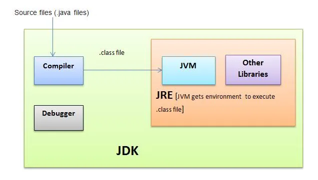

# **Core Java**

## **Java Architecture**

<div align="center">
  
</div>

#### JVM

> Write Once, Run anywhere

The JVM is responsible for executing Java bytecode. The JVM is a virtual machine that executes Java bytecode. It is responsible for running Java applications on a specific platform.

-  One of the key features of the JVM is its ability to provide platform independence. Since Java applications are compiled into bytecode, which is then executed by the JVM, the same bytecode can run on any system with a compatible JVM, regardless of the underlying hardware and operating system.
- Compile Languages
  - In a compiled language, the source code is translated into machine code or an intermediate code by a compiler before it is executed.
- Interpreted Languages
  - In an interpreted language, the source code is not translated into machine code before execution. Instead, an interpreter reads and executes the code line by line or statement by statement at runtime.
- Java programs are compiled into byte code that can run in the JVM, objects are created in the heap space.
- JVM Components
  - Class Loader
  - Runtime Data Area
  - Execution Engine

##### Class Loader
- Loads Java classes into memory as they are referenced by the program.
    - Loading : Bootstrap Class, Extension Class Loader, Application Class Loader
    - Linking : Verification, Preparation, Resolution
    - Initialization : calling constructors, executing static block, assigning values to static variables

##### Runtime Data Area
- Each area serve a specific purpose in memory management
    - Method Area
    - Heap Area
    - Stack Area
    - PC(Program Counter) Register
    - Native Method Stack

##### Execution Engine
- Interprets or compiles bytecode into native machine code for execution.
    - Interpreter
    - JIT Compiler : Compiles bytecode to Machine code.
    - GC (System.GC();)
    - Java Native Interface : Is a bridge that permit supporting packages for other programming languages like C/C++.

###### JVM languages

- Scala
- Groovy
- Kotlin


#### **JRE**

- The JRE is a runtime environment that is necessary for running Java applications. It includes the JVM and a set of standard class libraries that are required for executing Java programs.
- The JRE does not include development tools (e.g., compiler) or source code. It is designed for end-users who want to run Java applications.
- End-users need a JRE installed on their system to execute Java applications.

#### **JDK**

- The JDK is a software development kit used for developing Java applications. It includes the tools, executables, and libraries needed for Java development.
- The JDK contains the Java Compiler (javac) for compiling Java source code into bytecode, various utilities for building and packaging Java applications, and a set of libraries and APIs.
- It also includes the JRE (Java Runtime Environment) as part of its package, so developers can run and test their Java applications during development.


## **public static void main**

- public
  - Access modifier of main class.
  - Makes the main function globally available.
- static
  - `main()` is static so that the compiler can call the method without the object of a class.
- void
  - Return type of method.
- String[] arg

  - Stores java command line arguments. It is used to pass command-line arguments to a java program when executed from the command line.

  ```java
  public class HelloWorld {
   public static void main(String[] args) {
  	  System.out.println("Hello World!");
       }
   }


   // Java 21
  void main(){
   System.out.println("Hello World!");
  }
  ```

## **Overloading the main method**
- The main method in Java can be overloaded.
- You can have multiple main methods in the same class, as long as they have the same signature with different parameters.
- However, the main method that serves as the entry point for a Java application must have the signature `public static void main(String[] args)`.

```java
public class MainClass {
    
    // Main method with String array argument
    public static void main(String[] args) {
        System.out.println("Inside main method with String array argument.");
        for (String arg : args) {
            System.out.println("Argument: " + arg);
        }
    }

    // Overloaded main method with a single String argument
    public static void main(String arg) {
        System.out.println("Inside overloaded main method with single String argument.");
        System.out.println("Argument: " + arg);
    }

    // Another overloaded main method with no arguments
    public static void main() {
        System.out.println("Inside another overloaded main method with no arguments.");
    }
}
```
## **Dynamic method dispatch**
- Dynamic method dispatch is a mechanism in object-oriented programming languages, that allows the selection of the method to invoke at runtime rather than at compile time. It enables polymorphism
- Dynamic method dispatch is primarily associated with method overriding, where a subclass provides a specific implementation of a method that is already defined in its superclass.

```java
// Superclass
class Animal {
    void sound() {
        System.out.println("Animal makes a sound");
    }
}

// Subclass
class Dog extends Animal {
    @Override
    void sound() {
        System.out.println("Dog barks");
    }
}

// Another Subclass
class Cat extends Animal {
    @Override
    void sound() {
        System.out.println("Cat meows");
    }
}

public class Main {
    public static void main(String[] args) {
        Animal animal1 = new Dog(); // Dog object
        Animal animal2 = new Cat(); // Cat object
        
        animal1.sound(); // Dynamic method dispatch: invokes Dog's sound() method
        animal2.sound(); // Dynamic method dispatch: invokes Cat's sound() method
    }
}

```
## **Primitive**

- A primitive is a data type that represents a single value and is not an object.
- There are 8 primitive datatypes in java
  - boolean(default false)
  - byte
  - short
  - int
  - long
  - float
  - double
  - char
- Null cannot be assigned to a primitive data-type.
- They hold actual data and not the reference.
- They are immutable.

  ```java
  int age = 30;
  double price = 49.99;
  char grade = 'A';
  boolean isJavaFun = true;

  ```

## **Wrapper Classes**

- Wrapper classes are classes that encapsulate Java's primitive types, allowing them to be treated as objects.
- This enables the programmer to use them in scenarios where objects need to be used instead of primitive types. ie Collections, Generics, API's etc.
- Wrapper classes provides a set of methods and constructors for converting between primitives and objects, and for performing various operation.
- There are 8 Wrapper classes in java

  - Integer- int
  - Long - long
  - Short - short
  - Byte - byte
  - Double - double
  - Float - float
  - Character - char
  - Boolean - boolean

  ```java
  // Using Integer and int
  Integer wrappedInt = Integer.valueOf(42); // Wrapping an int
  int unwrappedInt = wrappedInt.intValue();   // Unwrapping to get the int value

  // Autoboxing and unboxing (Java automatically converts between primitive and wrapper)
  Integer num = 10; // Autoboxing - int to Integer
  int result = num; // Unboxing - Integer to int

  ```

## **Reference Types and Primitive Types**

A "reference type" refers to the data type that represents references to objects rather than the objects themselves. This is in contrast to "primitive types," which directly store the values they represent.

## **Call by Value**
- In call by value, a copy of the actual parameter's value is passed to the method or function.
- The method works with this copy, and any modifications made to the parameter inside the method do not affect the original value outside the method.
- Java always uses call by value for passing arguments to methods.

## **Call by Reference**
- In call by reference, a reference to the actual parameter (memory address or pointer) is passed to the method or function.
- Any modifications made to the parameter inside the method will affect the original value outside the method.
- Some programming languages, such as C and C++, support call by reference.

## **Literals**

- literal is a representation of a fixed value that is expressed in the source code of a program
- Integer Literals: Used to represent whole numbers.
  Example: int num = 42;

- Floating-Point Literals: Used to represent decimal numbers.
  Example: double pi = 3.14159;

- Character Literals: Used to represent a single character enclosed in single quotes.
  Example: char letter = 'A';

- String Literals: Used to represent a sequence of characters enclosed in double quotes.
  Example: String name = "John";

- Boolean Literals: Used to represent boolean values (true or false).
  Example: boolean isStudent = true;

- Null Literal: Represents a special "null" value and is used to indicate that a reference does not refer to an object.
  Example: String str = null;

- Octal and Hexadecimal Literals: You can represent integers in octal (base 8) or hexadecimal (base 16) using prefixes.
  Octal Example: int octalValue = 075; (Note the leading '0' indicating octal).
  Hexadecimal Example: int hexValue = 0x1F; (Note the '0x' prefix indicating hexadecimal).

- Binary Literals (Java 7 and later): You can represent integers in binary using the 0b or 0B prefix.
  Example: int binaryValue = 0b1101;

- Underscores in Numeric Literals (Java 7 and later): You can use underscores to improve the readability of numeric literals.
  Example: long bigNumber = 1_000_000;

## **Class**
- A class is a fundamental building block of object-oriented programming (OOP).
- It serves as a blueprint or template for creating objects. 
- A class defines the properties (fields or attributes) and behaviors (methods) that objects of that class will have.
- Key features
    - Fields
    - Methods
    - Constructors
    - Access modifiers
    - Encapsulation
    ```java
    public class MyClass {
    private int intValue;  // Encapsulated field

    public void setIntValue(int value) {
        this.intValue = value;
    }

    public int getIntValue() {
        return intValue;
    }
    }
    ```
    - Inheritance
    ```java
    public class SubClass extends SuperClass {
    // ...
    }
    ```
    - Polymorphism
    ```java
    SuperClass myObject = new SubClass();
    ```

## **Object**
- Object is an instance of a class.
- Object is a key concept in object-oriented programming (OOP).
- A class serves as a blueprint or template for creating objects, and an object is a concrete instantiation of that class.
- Objects have a lifecycle that includes creation, usage, and eventually garbage collection when they are no longer referenced.

## **Object Initialization**
- Using Constructors

```java
MyClass obj = new MyClass();  // Default constructor
MyClass objWithParameters = new MyClass(param1, param2);  // Parameterized constructor

```

- Object Initialization Block:
    - An instance initializer block is a block of code within a class that is executed each time an instance of the class is created.

```java
public class MyClass {
    {
        // Instance initializer block
        // Code for initialization
    }

    // Other members of the class
}

```


- Initialization Through Method:
    - You can create methods in your class that perform initialization tasks and then call these methods after creating an object.

```java
    MyClass obj = new MyClass();
    obj.initialize();  // Custom initialization method

```


- Using Static Factory Methods:
    - Static factory methods are static methods that return an instance of the class. They are not constructors, but they can be used for object creation and initialization.

```java
public class MyClass {
    private MyClass() {
        // Private constructor
    }

    public static MyClass createInstance() {
        MyClass obj = new MyClass();
        // Additional initialization code
        return obj;
    }
}

```

- Using Builder Pattern:
    - The builder pattern involves using a separate builder class to construct an object with a fluent and readable syntax.

```java
MyClass obj = new MyClass.Builder()
                        .setParameter1(value1)
                        .setParameter2(value2)
                        .build();
```

- Initialization in Declaration:
    - You can initialize an object when it is declared, either directly or using an initializer block.
```java
MyClass obj = new MyClass() {
    // Anonymous class initializer block
    {
        // Code for initialization
    }
};
```

- Using Object Cloning
    - The `clone()` method in Java allows you to create a new object by copying an existing object.

```java
MyClass original = new MyClass();
MyClass cloned = (MyClass) original.clone();
```
## **Shallow cloning v/s Deep cloning**

#### Shallow cloning
- Shallow cloning creates a new object but does not create new instances of objects referenced by the original object. Instead, it copies references to the objects.
- Changes made to the nested objects in the clone will affect the original object and vice versa since they share references to the same nested objects.
#### Deep cloning
- Deep cloning creates a new object and recursively copies all the objects referenced by the original object, creating new instances for each nested object
- Changes made to the nested objects in the clone do not affect the original object, and vice versa.

## **Constructors**

- Constructors in Java are special methods that are used to create objects of a class.
- They are called automatically when an object is created using the `new` keyword.
- They are used to initialize the state of the object.
- Constructors have the same name as the class and do not have a return type, not even void.
- The need for constructors in Java arises from the fact that objects of a class may require some initial setup or state initialization before they can be used

Object Initialization:

```java

public class Circle {
private double radius;

      public Circle(double radius) {
          this.radius = radius;
      }

}

```

Overloading Constructors:

- Refers to the practice of defining multiple constructors for a class with different parameter lists. Java allows you to have more than one constructor in a class, as long as they have different parameter lists.

```java

public class Circle {
private double radius;

      public Circle() {
          this.radius = 0;
      }
      public Circle(double radius) {
          this.radius = radius;
      }

}

```

Default Constructor:

- A default constructor in Java is a constructor that is automatically provided by the Java compiler if a class does not explicitly define any constructors. It is also known as a no-argument constructor or the default no-arg constructor.

```java

public class Circle {
private double radius;

public static void main(String[] args){
MyClass obj = new MyClass();
}

}

```

## **Control-flow statements**

- Conditional Statements:
  - if: Executes a block of code if a condition is true.
  - if-else: Executes one block of code if a condition is true and another block if it's false.
  - else-if: Allows you to check multiple conditions in sequence.
  - switch: Performs different actions based on the value of an expression.
- Looping Statements:
  - for: Repeats a block of code a specified number of times.
  - while: Repeats a block of code as long as a condition is true.
  - do-while: Repeats a block of code at least once and then as long as a condition is true.
  - for-each (Enhanced for loop): Simplifies iterating over collections (arrays, lists, etc.).
- Transfer Statements:
  - break: Exits the nearest loop or switch statement.
  - continue: Skips the current iteration of a loop and continues with the next.
  - return: Exits a method, optionally returning a value.
  - throw: Used for exception handling to raise an exception.
- Exception Handling:
  - try-catch: Used to catch and handle exceptions that occur within a try block.
  - try-finally: Ensures a block of code (in the finally block) is executed regardless of whether an exception occurred.

## **super**

- `super` can be used to refer immediate parent class instance variable.
- `super` can be used to invoke immediate parent class instance method.

```java
class Parent{
    void display(){
        System.out.println("Parent");
    }
}

class Child extends Parent{
    void display(){
        super.display();
        System.out.println("Child");
    }
}

public class Main{
    public static void main(String args[]){
        Child child = new Child();
        child.display();
    }
}

Output
-----
Parent
Child
```

- `super` can be used to invoke immediate parent class constructor.

```java

super.name;
super.getName();
super(name);

```

- `super` is essential to maintain the inheritance hierarchy and enabling to access the parent class members and constructors when necessary.

## **this**

- `this` is used to access instance variables within a class. For example, if a method parameter has the same name as an instance variable, this can be used to access the instance variable.

```java
public class MyClass {
    private int value;

    public void setValue(int value) {
        this.value = value; // Assign the method parameter to the instance variable
    }
}

```

- `this` keyword can be used to call one constructor from another constructor in the same class. This is known as constructor chaining.

```java
public class MyClass {
    private int value;

    public MyClass() {
        this(0); // Calls the parameterized constructor with an initial value of 0
    }

    public MyClass(int value) {
        this.value = value;
    }
}

```

## **String**

- `String` is a class that represents a sequence of characters. Strings are widely used in Java programming, and they are used to store and manipulate text-based data such as names, addresses, and other textual information.
- `String` in Java are reference types, which means that they are actually objects that contain a reference to a memory location where the string's characters are stored. This is in contrast to primitive types (like int or char), which are not objects and are stored directly in memory.

## **Strings are immutable**
- Java strings are immutable, meaning their content cannot be changed after they are created. When you perform operations on a string that appear to modify it, such as concatenation or substring extraction, a new string is created with the modified content. This property makes `String` thread safe.

## **`intern()`**
- `intern()` is a method defined in the String class. When invoked on a String object, it checks if there is another string with the same content in the constant pool of the JVM. 
- If a string with the same content exists, it returns a reference to that string. 
- If not, it adds the string to the pool and returns a reference to it. 
- This helps in saving memory by reusing common string literals.
```java
String s1 = new String("hello");
String s2 = "hello";

// Here, s1 and s2 will reference different objects
System.out.println(s1 == s2); // Output will be false

// Using intern() to get the reference from the string pool
s1 = s1.intern();

// Now, s1 and s2 will reference the same object from the string pool
System.out.println(s1 == s2); // Output will be true
```

## **`==` operator v/s `equals()` method**

| `==` operator                                                                                                                                                                     | `equals()` method                                                                                                                                    |
| --------------------------------------------------------------------------------------------------------------------------------------------------------------------------------- | ---------------------------------------------------------------------------------------------------------------------------------------------------- |
| The `==` operator compares the references of two objects, including strings. It checks if two objects refer to the same memory location, i.e., if they are the exact same object. | The `equals()` method is a method defined in the Object class and overridden in the String class to compare the content of two objects for equality. |
| When used to compare strings, the == operator checks if two string variables refer to the same instance of the string object, not necessarily if their content is the same.       | When used to compare strings, the equals() method checks if the content (sequence of characters) of two string objects is the same.                  |

```java
String str1 = "Hello";
String str2 = "Hello";
String str3 = new String("Hello");

System.out.println(str1 == str2);   // true - both variables refer to the same "Hello" object in the string pool
System.out.println(str1 == str3);   // false - str3 refers to a different object created with the 'new' keyword

System.out.println(str1.equals(str2));   // true - both strings have the same content
System.out.println(str1.equals(str3));   // true - both strings have the same content
```

## `String str = "Hello"` v/s `String str = new String("Hello")`

| String str = "Hello"                                               | String str = new String("Hello")                                                                                         |
| ------------------------------------------------------------------ | ------------------------------------------------------------------------------------------------------------------------ |
| It references an existing string object in the pool if one exists. | It explicitly creates a new string object on the heap, regardless of whether an identical string is already in the pool. |
| More memory efficient.                                             | Less memory efficient.                                                                                                   |

## **String s = new String("Hi")**
- The string literal "Hi" creates one object in the string pool (if it doesn't already exist). This object represents the string "Hi".
- The new String("Hi") expression explicitly creates another string object (outside the string pool) with the value "Hi". This object is separate from the one created in the string pool.

## **String Constant Pool**
- The string pool, also known as the string constant pool, is a special area of memory in the Java heap that stores unique string literals. 
- When you create a string literal in Java, such as "Hello", "world", or any other string literal, Java checks if the string already exists in the pool. If it does, the new variable points to the existing string object in the pool. If not, a new string object is created in the pool, and the variable points to it.
- The string pool exists to conserve memory by ensuring that only one copy of each unique string literal is stored in memory. This helps optimize memory usage, especially when dealing with a large number of string variables with the same value.

```java
String s1 = "Hello"; // Creates a string object "Hello" in the string pool
String s2 = "Hello"; // Points to the same string object "Hello" in the string pool
String s3 = new String("Hello"); // Creates a new string object "Hello" outside the pool

```

## **String v/s String Builder v/s String Buffer**

| String                                                                                                                                                                                                            | String Builder                                                                                                 | String Buffer                                                                                                 |
| ----------------------------------------------------------------------------------------------------------------------------------------------------------------------------------------------------------------- | -------------------------------------------------------------------------------------------------------------- | ------------------------------------------------------------------------------------------------------------- |
| `String` objects are immutable, meaning that once a String object is created, its contents cannot be changed. Any modifications to a String object actually create a new String object with the modified content. | `StringBuilder` is a mutable class that allows you to modify a string's content without creating a new object. | `StringBuffer` is a mutable class that allows you to modify a string's content without creating a new object. |
| This makes String objects thread-safe and secure                                                                                                                                                                  | `StringBuilder` objects are not thread-safe and should not be used in a multi-threaded environment             | `StringBuffer` objects are thread-safe and can be used in a multi-threaded environment                        |
| Slow                                                                                                                                                                                                              | Faster than `String`                                                                                           | `StringBuffer` is thread-safe, making it ideal for multi-threaded environments                                |

## **`static`**

- `static` keyword is used to create variables, methods, and nested classes that belong to the class rather than to any specific instance of the class.

#### Static Variables
- They are also known as Class Variables, they are shared by all instances of a class. 
- They are initialized only once when the class is loaded, and any changes to them are reflected across all instances of the class.
- The concept of call by value or call by reference does not apply to static fields, as they are not passed as arguments to methods. Instead, they are accessed directly by their class name.

```java
public class MyClass {
    public static int count = 0; // Static variable
}

```
#### Static Methods
- A static method is a method that belongs to the class rather than to any specific instance of the class.
- Static methods can be called directly on the class without the need to create an instance of the class.

```java
public class MyClass {
    public static void printMessage() { // Static method
        System.out.println("Hello, World!");
    }
}
```

#### Static Blocks
- Static blocks are used to initialize static variables or perform any other static initialization tasks.
- They are executed only once, when the class is loaded into memory.
- Static blocks are enclosed within curly braces and preceded by the `static` keyword.

```java
public class MyClass {
    static {
        System.out.println("Static block executed.");
    }
}

```
#### Static Final Fields (Compile-Time Constants): 
- Static final fields are constants that are initialized at compile time and cannot be changed thereafter. 
- They are typically used for defining constants
```java
public static final double PI = 3.14159;
```

#### Static nested classes
- Static nested classes: They are declared as static when they are nested inside another class. They are like regular nested classes, but they do not have access to the instance variables of the enclosing class.

```java

public class Person {
private String name;
private static class Address {
private String street;
private String city;
private String state;

          public Address(String street, String city, String state) {
              this.street = street;
              this.city = city;
              this.state = state;
          }

          public String getFullAddress() {
              return street + ", " + city + ", " + state;
          }
      }

      public Person(String name, String street, String city, String state) {
          this.name = name;
          this.address = new Address(street, city, state);
      }

      public String getFullAddress() {
          return address.getFullAddress();
      }

}

// Usage:
Person person = new Person("John Doe", "123 Main St", "Anytown", "CA");
System.out.println(person.getFullAddress()); // Prints "123 Main St, Anytown, CA"

```
##### Features
- Static variables are not serialized along with the object state. When an object is serialized, only the instance variables and their values are serialized, not the static variables. When the object is deserialized, static variables are initialized to their default values.
- Static methods and blocks can be synchronized, just like instance methods and blocks. However, the synchronization is at the class level, not at the instance level. This means that only one thread can execute a static synchronized method or block for a given class at a time.
- Static methods can be overloaded in the same way as instance methods. Overloading is the ability to define multiple methods in the same class with the same name but with different parameter lists.
- Static methods cannot be overridden in Java. When you declare a static method in a subclass with the same signature as a static method in the superclass, it hides the superclass method rather than overriding it.
- In Java `static` keyword is used in creating constants, utility methods, and factory methods.

```java
public class StaticExample {
    public static final double PI = 3.14159;

    public static int add(int a, int b) {
        return PI * a + b;
    }

    public static int multiply(int a, int b) {
        return PI * a * b;
    }
}

```

```java
public class StaticExample {
    // Static variable
    public static int count;

    // Static block
    static {
        System.out.println("Static block executed.");
        count = 0; // Initialize static variable
    }

    // Static method
    public static void incrementCount() {
        count++;
    }

    public static void main(String[] args) {
        // Accessing static variable and method
        System.out.println("Initial count: " + count); // Output: Initial count: 0
        incrementCount(); // Increment count
        System.out.println("Updated count: " + count); // Output: Updated count: 1
    }
}

//Output
// Static block executed.
// Initial count: 0
// Updated count: 1
```

## **static v/s instance**

| static                                                                                                | instance                                                                                                      |
| ----------------------------------------------------------------------------------------------------- | ------------------------------------------------------------------------------------------------------------- |
| Static members can be accessed using the class name.                                                  | Instance members can only be accessed through an instance of the class.                                       |
| Static members are allocated memory only once, regardless of the number of instances created.         | Instance members are allocated memory for each instance of the class.                                         |
| Static members have class-level scope.                                                                | Instance members have instance-level scope.                                                                   |
| Static members are used when you want to share data or functionality across all instances of a class. | Instance members are used when you want to have different data or functionality for each instance of a class. |

---

## **final**

- `final` keyword is used to declare entities that cannot be modified.
- When `final` is applied to a variable, the value of the variable cannot be changed once it is initialized.
- When `final` is applied to a method, the method cannot be overridden in the subclasses.
- When `final` is applied to a class, the class cannot be subclassed.

## **How to create a Custom Immutable class in java**

- Make the class final.
- Declare fields private and final.
- Provide no setter methods
- Provide constructor initialization.
- Immutable classes are designed to be unchangeable once they are created, which can lead to more predictable and robust code in various scenarios. They are also
  - Thread safe.
  - Safely cached
  - Secure

```java
public final class ImmutablePerson {
    private final String name;
    private final int age;

    public ImmutablePerson(String name, int age) {
        this.name = name;
        this.age = age;
    }

    public String getName() {
        return name;
    }

    public int getAge() {
        return age;
    }
}
```

## **finally**

- `finally` keyword is used to define a block of code that will be executed after a try block, whether an exception is thrown or not. It is often used to perform cleanup operations like closing a file or releasing a resource that was opened in the try block.

#### How to exit finally block
- If the `System.exit()` method is called inside the try or catch block, the JVM terminates and finally block won't be executed.
- Using return statement in the try block.
- Throwing another exception from the try block using `throw`.

## **finalize()**

- `finalize()` is a method in Java that is called by the garbage collector when an object is no longer being used and is about to be garbage collected.
- The purpose of `finalize()` is to give an object a chance to perform any necessary cleanup operations before it is destroyed.
- The `finalize()` method is defined in the Object class, so all classes in Java have a `finalize()` method inherited from Object. By default, the `finalize()` method does nothing, so if a class needs to perform cleanup operations, it should override this method.
- `finalize()` has been deprecated since Java 9. It is recommended to use try-catch-finally or try-with resources or `Autocloseable` interface instead.

## **Exception**
- Exception class is the superclass of all checked exceptions. It represents exceptional conditions that can be handled programmatically, such as I/O errors, network errors, and application-specific errors. Subclasses of Exception include `IOException`, `SQLException`, and `RuntimeException`.
- The parent class of the Exception class and Error class in Java is the Throwable class.

#### Exception Hierarchy
- The hierarchy in the catch block refers to the order in which catch blocks are organized to handle exceptions. 
- When an exception occurs in a try block, Java searches for an appropriate catch block to handle the exception based on the hierarchy of catch blocks.
- The hierarchy in the catch block follows a bottom-up approach, meaning that catch blocks for subclasses of exceptions should be placed before catch blocks for their superclass. 
- This ensures that more specific exceptions are handled before more general exceptions.

```java
try {
    // Code that may throw exceptions
} catch (FileNotFoundException e) {
    // Handle FileNotFoundException
} catch (IOException e) {
    // Handle IOException
} catch (Exception e) {
    // Handle other exceptions
}

```

## **Exception handling**

- Exception handling in Java is a mechanism to handle runtime errors and exceptional situations that may occur during the execution of a program.
- It is a way to gracefully recover from errors and prevent the program from crashing.
- Java provides a built-in mechanism to handle exceptions using the try-catch block.
- The try block contains the code that may cause an exception, and the catch block handles the exception if it occurs.

```java
try {
    // Code that may cause an exception
    int result = 10 / 0;
} catch (ArithmeticException e) {
    // Exception handling code
    System.out.println("An exception occurred: " + e.getMessage());
} finally {
    // Code that will always be executed
    System.out.println("Done!");
}
```

## **Checked Exceptions (Compile-Time Exceptions)**

- Checked exceptions are exceptions that the Java compiler requires you to handle explicitly in your code.
- These exceptions are typically related to external factors that your code may encounter, such as file I/O, network operations, or database connections.
- You are required to either catch and handle checked exceptions using a try-catch block or declare that your method may throw the exception using the throws clause.
- `IOException` `SQLException` `ClassNotFoundException`

## **Unchecked Exceptions (Runtime Exceptions)**

- Unchecked exceptions, also known as runtime exceptions, are exceptions that the compiler does not require you to catch or declare explicitly.
- They typically represent programming errors, such as dividing by zero, accessing an array index out of bounds, or attempting to call a method on a null object reference.
- Unchecked exceptions are subclasses of `RuntimeException`.
- You can catch and handle them, but it is not required by the compiler. Most of the time, they indicate bugs in your code that should be fixed.
- `ArrayIndexOutOfBoundsException`

#### Difference

Checked exceptions must be either caught or declared, while unchecked exceptions do not have this requirement. It is important to handle exceptions appropriately to ensure the robustness and reliability of your Java applications.

## **ClassNotFoundException v/s NoClassDefFoundError**

| ClassNotFoundException                                                                                                                                                                       | NoClassDefFoundError                                                                                                                              |
| -------------------------------------------------------------------------------------------------------------------------------------------------------------------------------------------- | ------------------------------------------------------------------------------------------------------------------------------------------------- |
| `ClassNotFoundException` is a checked exception that occurs at runtime when the Java ClassLoader is unable to find a class at the time of dynamic class loading.                             | `NoClassDefFoundError` is an error (not an exception) that occurs when a class that was present during compilation is no longer found at runtime. |
| This exception is typically thrown when you attempt to load a class using methods like Class.forName() or ClassLoader.loadClass(), and the specified class cannot be found in the classpath. | This error typically occurs when the JVM tries to load a class that was available during compilation but is missing during runtime execution.     |
| It often indicates a missing or incorrect class name or a missing dependency that the class depends on.                                                                                      | It indicates that the class definition was found during compilation, but at runtime, the class file is not present or cannot be located.          |

## **Custom Exception**

- Custom exceptions can be created by extending the Exception class or one of its subclasses like RuntimeException.
- By creating custom exceptions, developers can define their own exceptions for specific use cases, improving code clarity and allowing for more targeted exception handling.

```java

public class CustomException extends Exception {
    public CustomException(String message) {
        super(message);
    }
}

```

## **Throw**

- `throw` is a keyword used to throw an exception explicitly. It is used to throw a custom or predefined exception explicitly within a method or block of code.

```java

public void divide(int a, int b) {
    if (b == 0) {
        throw new ArithmeticException("Division by zero is not allowed");
    }
    int result = a / b;
    System.out.println("Result: " + result);
}

```

## **Throws**

- `throws` keyword is used in method signatures to declare that a method might throw certain types of checked exceptions.
- When a method declares that it throws an exception, it means that the method might encounter a situation that could cause an exception to be thrown, and that the method is not able to handle that exception on its own. Instead, the method declares that it might throw the exception, and it is the responsibility of the calling code to handle the exception.

```java

public void readFromFile(String filename) throws IOException {
// code to read from the file
}

```
## **Error**
- Error class is the superclass of all unchecked exceptions. It represents serious errors that typically cannot be recovered from, such as `OutOfMemoryError`, `StackOverflowError`, and `AssertionError`. Errors are typically caused by external factors or problems with the environment in which the Java Virtual Machine (JVM) is running.

## **Stack Overflow Error**
- Stack Overflow typically refers to a specific runtime error that occurs when the call stack of a program exceeds its allocated size.
- The call stack is a region of memory used to manage function/method calls and local variables in a program. Each time a method is called, a new frame is added to the call stack, and when the method completes, its frame is removed.
- When a method calls itself (recursion), and the recursion is not properly bounded or limited, it can lead to a situation where the call stack becomes full, resulting in a StackOverflowError.
- A stack overflow in Java is often associated with infinite or excessively deep recursion.

## **Arrays**
- Array is a data structure that allows you to store multiple values of the same type under a single variable name.
- Arrays are used to store elements of a specific type in contiguous memory locations. 
- Each element in an array can be accessed using an index, starting from 0 for the first element to n-1.
```java
// Declaration and initialization of an array of integers
int[] numbers = {1, 2, 3, 4, 5};

// Declaration and initialization of an empty array of strings
String[] names = new String[3]; // Creates an array of size 3
names[0] = "Alice";
names[1] = "Bob";
names[2] = "Charlie";
```
## **Collection**

- "Collection" refers to a framework or a group of classes and interfaces that are used to store, manipulate, and manage groups of objects.
- Collections provide a convenient and efficient way to work with groups of data, such as lists of items, sets of unique elements, and mappings of key-value pairs.
- Interfaces in Collection

  - `Collection`: The root interface for all collections. It defines common methods like add, remove, contains, and iterator.

  - `List`: Represents an ordered collection of elements with duplicate values. Class implementations include ArrayList and LinkedList.

  - `Set`: Represents an unordered collection of unique elements. Class implementations include HashSet, LinkedHashSet, and TreeSet.

  - `Map`: Represents a collection of key-value pairs, where each key is associated with a unique value. Class implementations include HashMap, LinkedHashMap, and TreeMap.
  - `Queue`: Represents a data structure for managing elements in a First-In-First-Out (FIFO) order, where elements are processed in the order they are added. Class implementations include PriorityQueue, ArrayDeque, and LinkedList.

## **Collection v/s Collections**

| Collection                                                                                                                                                                                                                       | Collections                                                                                                                                                                                                                                                                                                              |
| -------------------------------------------------------------------------------------------------------------------------------------------------------------------------------------------------------------------------------- | ------------------------------------------------------------------------------------------------------------------------------------------------------------------------------------------------------------------------------------------------------------------------------------------------------------------------ |
| `Collection` is an interface that is part of the Java Collections Framework. It's a fundamental interface that represents a group of objects, or elements, and provides a common set of methods for working with these elements. | `Collections` is a utility class in the java.util package. It contains a set of static methods that operate on or provide utility for objects that implement the Collection interface. These methods are used for common collection-related tasks, such as sorting, searching, shuffling, and synchronizing collections. |

```java
Collection<Integer> myCollection = new ArrayList<>();
myCollection.add(3);
myCollection.add(1);
myCollection.add(7);

Collections.sort(myCollection);
```

## **List**

- List is an interface that represents an ordered collection of elements.
- Elements in a List can be accessed by their index, and a List can contain duplicate elements.
- List interface implementations
  - ArrayList
  - LinkedList
  - Vector
  - CopyOnWriteArrayList

### **ArrayList**

- ArrayList is an implementation of the List interface that uses a dynamic array to store its elements.
- It provides fast random access to elements, making it suitable for scenarios where you frequently access elements by their index.
- Adding or removing elements at the end of an ArrayList is efficient, but adding or removing elements in the middle requires shifting subsequent elements, which can be less efficient.
- Suitable for scenarios that involve mainly read operations, but its performance may degrade when many elements are added or removed frequently.

##### **Dynamic Array**

A dynamic array is a data structure that can grow or shrink in size as needed. It is implemented as a single contiguous block of memory, and elements are stored in adjacent memory locations.

### **LinkedList**

- LinkedList is another implementation of the List interface that uses a doubly-linked list to store its elements.
- While LinkedList supports random access, accessing elements by index is slower compared to ArrayList because it requires traversing the list from the beginning or end to reach the desired index.
- It provides fast insertions and removals at any position in the list because it only requires adjusting a few references.
- Suitable for scenarios where you frequently add or remove elements in the middle of the list, as well as for implementing queues or other data structures.

##### **Doubly-linked list**

A doubly linked list is a data structure consisting of nodes, where each node contains a data element and two references (pointers) to the previous and next nodes in the list.

### **Vector**
- Vector is a legacy class that was part of the original Java Collections Framework. 
- It is a resizable, thread-safe implementation of the List interface, meaning it allows you to store and manipulate ordered collections of elements. 
- Vector implements the List interface
- It is thread safe.

##### **Arraylist v/s Vector**
| Arraylist      | Vector      |
| ------------- | ------------- |
| ArrayList is not synchronized, meaning it is not thread-safe | Vector is synchronized, making it thread-safe. |
| ArrayList is part of the Java Collections Framework introduced in Java 2.0 | Vector is a legacy class that predates the Java Collections Framework |
| Arraylist has better performance | Vector may have slower performance compared to ArrayList, especially in single-threaded scenarios |

## **Set**

- Set is an interface in the Java Collections Framework that represents a collection of unique elements, where each element can occur at most once.
- Set implementations provide a way to store, retrieve, and manipulate elements without duplicates.
- Set interface implementations
  - HashSet
  - LinkedHashSet
  - TreeSet
  - EnumSet

### HashSet

- Elements are stored in a hash table and do not maintain any specific order. You cannot rely on the order of elements in a HashSet.
- HashSet offers constant-time performance for basic operations like adding, removing, and checking for the existence of elements. i.e., they are fast.

### LinkedHashSet

- LinkedHashSet extends HashSet and maintains the order of elements by using a linked list. When you iterate over a LinkedHashSet, the elements are returned in the order they were added. This provides a predictable iteration order.
- Operations may be slightly slower than those of a HashSet, although they are still quite efficient.

## **Map**

- Map is an interface in the Java Collections Framework that represents a collection of key-value pairs.
- Each key in a Map is associated with a corresponding value, and you can use the key to retrieve its associated value.
- Map implementations provide efficient means to store, retrieve, and manipulate key-value pairs.
- Map interface implementations
  - HashMap
  - TreeMap
  - LinkedHashMap
  - HashTable

### HashMap

- HashMap is an implementation of the Map interface that does not guarantee any specific order for its elements.
- Key-value pairs are stored based on the hash code of the keys, making the retrieval of values efficient.
- The order of elements in a HashMap is not guaranteed and may change over time as the map is modified. This means that the elements are not stored in a specific order.

#### Features
- HashMap stores data as key-value pairs, where each key is associated with exactly one value. Both keys and values can be of any reference type, including `null`. Key-value pairs are added, retrieved, and updated using the `put()` and `get()` methods.
- Each key in a HashMap must be unique. Duplicate keys are not allowed. If you attempt to add a duplicate key, the existing value associated with that key will be replaced with the new value.
- HashMap allows `null` keys and values. You can have at most one `null` key and multiple `null` values.
- HashMap does not guarantee the order of its elements. The iteration order of the elements may change over time, especially when the HashMap is modified (e.g., adding or removing elements).
- HashMap allows adding a custom object as a key in a HashMap. However, the custom class must ovverride `hashCode()` and `equals()`. The custom objects should also be immutable.
- HashMap provides constant-time performance for the basic operations (addition, removal, and retrieval of key-value pairs) on average, making it suitable for most scenarios where quick access to data is required.

#### Working
- When you add a key-value pair to a HashMap, the key is passed through a hashing function to generate a hash code. The hash code is an integer value that represents the key.
- The hashing function aims to evenly distribute keys across the available buckets in the hash table.
- Internally, a HashMap maintains an array of linked lists or arrays called "buckets."
- Each bucket corresponds to a unique hash code.
- The size of the bucket array is determined by the initial capacity and load factor of the HashMap. The load factor determines when the HashMap should resize its internal array to accommodate more elements.
- After computing the hash code, the HashMap determines the index of the bucket where the key-value pair should be stored.
- If the bucket is empty, the key-value pair is added directly to the bucket.
- If the bucket is not empty (collision occurs), the HashMap appends the key-value pair to the end of the linked list or array in that bucket.
- To resolve collisions, some implementations of HashMap may use techniques like separate chaining (linked lists) or open addressing (probing).
- When you want to retrieve the value associated with a key, the HashMap computes the hash code of the key and determines the corresponding bucket.
- It then searches the linked list or array in that bucket to find the key-value pair with the matching key.
- If the key is found, the associated value is returned. Otherwise, null is returned to indicate that the key is not present in the HashMap.
- The average time complexity for insertion, deletion, and retrieval operations in a HashMap is O(1) (constant time)

### LinkedHashMap

- LinkedHashMap is another implementation of the Map interface, but it maintains the order of elements based on the order in which they were added.
- The order of elements in a LinkedHashMap is predictable and matches the insertion order. This means that when you iterate through a LinkedHashMap, the elements are returned in the order they were added.

```java
Map<String, Integer> linkedHashMap = new LinkedHashMap<>();
linkedHashMap.put("Alice", 25);
linkedHashMap.put("Bob", 30);
linkedHashMap.put("Carol", 22);
```

##### Connection between HashMap and HashSet
- They both use hash tables to achieve their functionality efficiently. 
- A HashSet is essentially a HashMap where the elements are the keys, and the values associated with those keys are a constant (PRESENT in the case of HashSet) indicating that the key is present.
- A HashSet is backed by a HashMap where the elements are the keys, and the values are a constant (usually PRESENT).
- When you add an element to a HashSet, it is essentially being added as a key in the underlying HashMap.
- When you perform operations like contains on a HashSet, it is utilizing the HashMap operations.

##### HashTable v/s HashMap

| HashTable     | HashMap     |
| ------------- | ------------- |
| Hashtable is synchronized, meaning it is thread-safe. All its methods are synchronized, making it suitable for concurrent access from multiple threads without external synchronization. | HashMap is not synchronized by default. It is not thread-safe and may lead to data corruption if accessed concurrently by multiple threads.  |
| Neither keys nor values can be null in a Hashtable. Attempting to insert a null key or value will result in a `NullPointerException`. | HashMap allows one null key and multiple null values.  |
| Hashtable is a legacy class that was part of the original Java Collections Framework | HashMap is a modern implementation introduced later in Java's development. It offers more flexibility and better performance compared to Hashtable. |

## **Concurrent Hashmap**

- Concurrent HashMap is a class in Java's that provides a thread-safe implementation of the Map interface without need for synchronization.
- Partitioning: It divides the map into smaller segments, known as "buckets." Each bucket can be independently locked, so multiple threads can access different buckets simultaneously. This minimizes contention among threads.

## **Synchronized Hashmap**

- Synchronized HashMap is a class in Java's that provides a thread-safe implementation of the Map interface wrapped with synchronization to make it thread-safe.
- Locking: Synchronized HashMap uses a single global lock that serializes access to the entire map. This can lead to contention in high-concurrency situations, making it less scalable.
- This can lead to contention and performance issues in highly concurrent environments.

## **Queue**

- Queues in Java are a fundamental data structure used to store and manage a collection of elements in a linear order. They follow the "first-in, first-out" (FIFO) principle, which means that the element added first is the one that gets removed first. Queues are typically used for tasks such as managing tasks in a job queue, implementing scheduling algorithms, or handling asynchronous processing.

#### PriorityQueue

- Priority queue implementation based on a binary heap. It orders elements according to their natural order or a specified comparator.

#### LinkedList

- A doubly-linked list that can be used as a queue.

## **Iterator**

- Iterator is an interface that belongs to the Java Collections Framework. It provides a way to traverse or iterate over elements in a collection (such as a List, Set, or Map) without exposing the underlying data structure.
- Iterators are commonly used to access and manipulate the elements in a collection, and they are especially useful when you need to sequentially process the elements.
- Iterators are commonly used behind the scenes in both for-each loops and traditional for loops to iterate over collections.
- Under the hood, the compiler translates the enhanced for loop into an equivalent loop using an iterator.

```java
public class IteratorExample {
    public static void main(String[] args) {
        List<String> names = new ArrayList<>();
        names.add("Alice");
        names.add("Bob");
        names.add("Charlie");

        for(String name: names){
            System.out.println(name);
        }
        // Get an iterator for the list
        Iterator<String> iterator = names.iterator();

        // Iterate over the list using the iterator
        while (iterator.hasNext()) {
            String name = iterator.next();
            System.out.println(name);
        }
    }
}

```

## **Fail-fast Iterator v/s Fail-safe Iterator**
Fail-fast Iterator & Fail-safe Iterator are two different approaches used by iterators in Java to handle concurrent modification of collections while iterating over them.

#### Fail-fast Iterator
- Fail-fast iterators, throw a `ConcurrentModificationException` if the underlying collection is structurally modified (i.e., if elements are added, removed, or modified) after the iterator is created.
- This behavior ensures that the iterator fails quickly and explicitly when concurrent modification occurs, rather than risking unpredictable behavior or data corruption.
- Fail-fast iterators are typically used in the collections framework classes such as `ArrayList`, `HashMap`, `HashSet`, etc.
- Generally more efficient since it doesn't need to create a copy.
- Generally used in single-threaded environments.

#### Fail-safe Iterator
- Fail-safe iterators, do not throw a `ConcurrentModificationException` if the underlying collection is modified during iteration. Instead, they work on a copy of the collection's elements at the time the iterator was created.
- This approach ensures that the original collection remains unaffected by concurrent modifications during iteration, but it may not reflect the latest changes made to the collection.
- Fail-safe iterators are commonly used in concurrent collections or in situations where concurrent modifications are expected, such as in multi-threaded environments. Eg: `CopyOnWriteArrayList`, `CopyOnWriteArraySet` etc.
- May be less efficient due to creating a copy.
- Commonly used in concurrent or multi-threaded environments.

## **Comparable**

- Comparable is an interface in Java that is used for defining the natural ordering of objects of a class. By implementing the Comparable interface, a class specifies how its instances should be compared with each other.
- If a class implements the Comparable interface, it must implement the `compareTo` method, which compares the object with another object of the same type.
- The `compareTo` method returns an integer value:
  - Negative value: if the current object is less than the specified object.
  - Zero: if the current object is equal to the specified object.
  - Positive value: if the current object is greater than the specified object.

```java
public class Student implements Comparable<Student> {
    // ...
    @Override
    public int compareTo(Student other) {
        // Compare students based on their IDs
        return Integer.compare(this.id, other.id);
    }
}
```

## **Comparator**

- Comparator is an interface in Java that defines a way to compare two objects for ordering or sorting purposes.
- It allows you to define custom comparison logic for objects that may not have a natural ordering or for cases where you want to sort objects based on criteria other than their natural order.
- This is suitable when you need to provide multiple ways to compare objects or when you can't modify the class of the objects being compared.

```java
public class ComparatorDemo {
    public static void main(String[] args) {
        List<Person> people = new ArrayList<>();
        people.add(new Person("Jabbar", 1));
        people.add(new Person("Alice", 30));
        people.add(new Person("Bob", 25));
        people.add(new Person("Charlie", 35));

        // Collections.sort(people, new AgeComparator());

        // Sorting using a Comparator
        people.sort(Comparator.comparingInt(Person::getAge));
        System.out.println("Age");
        people.forEach(person -> System.out.println(person.getName() + " - " + person.getAge()));

        people.sort(Comparator.comparing(Person::getName));
        System.out.println("Name");
        people.forEach(person -> System.out.println(person.getName() + " - " + person.getAge()));
    }
}

Output
------
Age
Jabbar - 1
Bob - 25
Alice - 30
Charlie - 35
Name
Alice - 30
Bob - 25
Charlie - 35
Jabbar - 1
```
## **Example using Comparable and Comparator**

```java
// Person class implementing Comparable for natural ordering
class Person implements Comparable<Person> {
    private String name;
    private int age;

    public Person(String name, int age) {
        this.name = name;
        this.age = age;
    }

    public String getName() {
        return name;
    }

    public int getAge() {
        return age;
    }

    @Override
    public int compareTo(Person otherPerson) {
        // Compare based on age for natural ordering
        return Integer.compare(this.age, otherPerson.age);
    }

    @Override
    public String toString() {
        return "Person{" +
                "name='" + name + '\'' +
                ", age=" + age +
                '}';
    }
}

public class SortingExample {
    public static void main(String[] args) {
        List<Person> people = new ArrayList<>();
        people.add(new Person("Alice", 30));
        people.add(new Person("Bob", 25));
        people.add(new Person("Charlie", 35));

        System.out.println("Before sorting:");
        System.out.println(people);

        // Sorting using Comparable (natural order)
        Collections.sort(people);
        System.out.println("\nAfter natural order sorting (by age):");
        System.out.println(people);

        // Sorting using Comparator (custom order by name)
        Comparator<Person> nameComparator = Comparator.comparing(Person::getName);
        Collections.sort(people, nameComparator);
        System.out.println("\nAfter sorting by name using Comparator:");
        System.out.println(people);
    }
}

```

## **Which collection should we use during multithreading?**

- ConcurrentHashMap
- ConcurrentLinkedQueue
- CopyOnWriteArrayList
- Synchronized Collections
  - You can make existing non-thread-safe collections thread-safe by wrapping them using Collections.synchronizedCollection, Collections.synchronizedList, Collections.synchronizedSet, etc.

## **Generics**

- Generics allows you to write classes, methods, and interfaces in a way that can work with different data types while providing compile-time type safety. Generics enable you to create reusable and type-safe code by parameterizing types.

```java
class Box<T> {
    private T value;

    public Box(T value) {
        this.value = value;
    }

    public T getValue() {
        return value;
    }
}

public class Main {
    public static void main(String[] args) {
        // Create a Box to hold an Integer
        Box<Integer> integerBox = new Box<>(42);
        int intValue = integerBox.getValue();
        System.out.println("Integer Value: " + intValue);

        // Create a Box to hold a String
        Box<String> stringBox = new Box<>("Hello, Generics!");
        String stringValue = stringBox.getValue();
        System.out.println("String Value: " + stringValue);

        // Create a Box to hold a Double
        Box<Double> doubleBox = new Box<>(3.14159);
        double doubleValue = doubleBox.getValue();
        System.out.println("Double Value: " + doubleValue);
    }
}
```

- `Box` class is defined with a generic type parameter `T`. This allows you to create `Box` objects that can hold values of different types, such as integers and strings, while maintaining type safety.

- Generics are commonly used in Java when working with data structures like collections (e.g., `ArrayList<T>`) and when defining utility classes and methods that need to operate on different data types.

## **Interface**

- An interface is a collection of abstract methods (methods without implementation) that can be used to define a contract that a class must adhere to.
- Interfaces are used to define common behavior that can be shared among multiple classes.
- They provide a way to achieve abstraction, multiple inheritance.
- Constant variable, which is implicitly public, static, and final
- The `implements` keyword is used.

```java
interface Drawable {
    void draw();
}

class Shape implements Drawable {
    public void draw() {
        System.out.println("Drawing a shape...");
    }
}

class Text implements Drawable {
    public void draw() {
        System.out.println("Drawing text...");
    }
}

public class InterfaceExample {
    public static void drawShapes(Drawable[] shapes) {
        for (Drawable shape : shapes) {
            shape.draw();
        }
    }

    public static void main(String[] args) {
        Shape circle = new Shape();
        Text message = new Text();

        Drawable[] drawings = {circle, message};
        drawShapes(drawings);
    }
}

```

## **Abstract Class**

- An abstract class is a class that cannot be instantiated directly, but can be extended by other classes. It serves as a blueprint for other classes to derive from and provides common functionality that can be inherited by its subclasses.
- An abstract class cannot be instantiated, meaning we cannot create objects of it, but we can use it as a template for creating other classes that extend it.

```java
abstract class Shape {
    abstract double calculateArea();

    void draw() {
        System.out.println("Drawing a shape...");
    }
}

class Circle extends Shape {
    double radius;

    @Override
    double calculateArea() {
        return Math.PI * radius * radius;
    }
}

class Rectangle extends Shape {
    double length, width;

    @Override
    double calculateArea() {
        return length * width;
    }
}

public class AbstractClassExample {
    public static void main(String[] args) {
        Circle circle = new Circle(5);
        Rectangle rectangle = new Rectangle(4, 3);

        System.out.println("Circle area: " + circle.calculateArea());
        System.out.println("Rectangle area: " + rectangle.calculateArea());
    }
}

```

## **Interface v/s Abstract Class**

| Interface                                   | Abstract Class                                       |
| ------------------------------------------- | ---------------------------------------------------- |
| Classes can implement multiple interfaces.  | Classes can implement only one abstract class.       |
| Can have only abstract methods.             | Can have both abstract methods and concrete methods. |
| Methods are by default public and abstract. | Methods can have any access modifiers.               |
| Constructors are not allowed.               | Constructors are allowed.                            |
| Instance variables are not allowed.         | Instance variables are allowed.                      |

---

## **Abstract Method**

- An abstract method is a method that is declared in an abstract class or an interface but does not have an implementation.
- It serves as a template or a contract for the derived classes or implementing classes to provide their own implementation.

## **Marker Interface**

- A marker interface is an empty interface that does not contain any methods.
- It is used to mark or tag classes that implement it, indicating that they possess a certain behavior or characteristic.
- Examples of marker interfaces in Java include `Serializable`, `Cloneable`, and `Remote`.

## **Cloneable Interface**

- The Cloneable interface in Java is a marker interface.
- It is used to indicate that an object can be cloned using the `clone()` method.
- `clone()` method in Java creates a shallow copy of the object, which means that the cloned object will share references with the original object for its non-primitive fields. If you need to create a deep copy of an object, you would need to implement custom logic in the `clone()` method to create a completely independent copy of the object, including its non-primitive fields.

## **Serializable Interface**

- The Serializable interface in Java is a marker interface.
- Serializable interface in Java is used to indicate that an object's state can be converted into a stream of bytes and then be restored back into an object again.
- This process is known as serialization and deserialization, respectively

## **Serialization in java**
- Serialization is the process of converting an object into a stream of bytes, allowing the object to be easily stored, transmitted over a network, or persisted to a storage medium such as a file or a database. Serialization is primarily used in Java to make objects persistent or transportable.

#### Serialization scenarios
- Persistence: Objects can be serialized and stored in a database, allowing them to be retrieved and reconstructed later.
- Inter-process Communication: Objects can be serialized and transmitted between different processes or across a network, enabling communication between distributed systems.
- Caching: Serialized objects can be cached in memory or on disk to improve performance and reduce data retrieval overhead.
- Deep Copying: Serialization can be used to create deep copies of objects by serializing and then deserializing them, effectively creating a new instance with the same state.

#### `serialVersionUID`
- When implementing the Serializable interface in Java, you have the option to declare a `serialVersionUID` field in your class. 
- This field is a version identifier that uniquely identifies the version of the class for the purpose of serialization. It helps in ensuring that the serialized data is compatible between different versions of the class.

###### Backward compatibility
- When you declare a `serialVersionUID` in a class implementing the Serializable interface, you gain more control over how instances of that class are serialized and deserialized. This control is particularly useful when you need to maintain backward compatibility with previously serialized data across different versions of your application.
- As your application evolves, you may make changes to the class definition of a serializable class. These changes could include adding or removing fields, changing field types, or modifying method signatures. In some cases, these changes might render the new version of the class incompatible with previously serialized instances of the class.

```java
import java.io.Serializable;

public class MyClass implements Serializable {
    private static final long serialVersionUID = 123456789L;

    // Class members and methods
}

```

## **Functional Interface**

- Functional interface is an interface that has exactly one abstract method.
- Functional interfaces are also known as single abstract method (SAM) interfaces.
- They are used to support the lambda expressions and functional programming style
- They can have any number of default methods or static methods.
- It's a good practice to annotate a functional interface with `@FunctionalInterface`. This annotation serves as a marker, and if a developer accidentally adds more than one abstract method, the compiler will generate an error.

```java

@FunctionalInterface
interface MyFunctionalInterface {
    // Abstract method
    void myMethod();

    // Default method
    default void myDefaultMethod() {
        System.out.println("Default method implementation");
    }

    // Static method
    static void myStaticMethod() {
        System.out.println("Static method implementation");
    }
}

public class LambdaExample {
    public static void main(String[] args) {
        // Lambda expression for the abstract method
        MyFunctionalInterface myFunction = () -> System.out.println("Lambda expression for myMethod");

        // Calling the abstract method using the lambda expression
        myFunction.myMethod();

        // Calling the default method
        myFunction.myDefaultMethod();

        // Calling the static method
        MyFunctionalInterface.myStaticMethod();
    }
}


//Output
Lambda expression for myMethod
Default method implementation
Static method implementation

// Functional interface implementation without lambda expression
interface MyFunctionalInterface {
    void myMethod();
}

// Concrete class implementing the interface
class MyImplementation implements MyFunctionalInterface {
    @Override
    public void myMethod() {
        System.out.println("Implementation of myMethod");
    }
}

public class Main {
    public static void main(String[] args) {
        // Create an instance of the concrete class
        MyImplementation myObject = new MyImplementation();

        // Call the implemented method
        myObject.myMethod();  // Output: Implementation of myMethod
    }
}
```

## **Default method**
- It is a method defined within an interface that provides a default implementation
- Default methods support the evolution of interfaces over time. As the requirements of an interface change, new methods can be added with default implementations, allowing for a more flexible and extensible design.
- Default methods can provide sensible default behavior for methods that don't need to be implemented by every implementing class.
- When new default methods are introduced in an interface, existing classes implementing the interface won't be affected. They can still use the default method if needed. 
- Default methods enable a form of multiple inheritance in Java interfaces. If a class implements multiple interfaces that have conflicting method signatures, the class must provide an implementation for the conflicting methods. However, if one of the conflicting methods is a default method, the conflict is resolved, and the class inherits the default implementation.

```java

public interface MyInterface {
    default void myMethod() {
        System.out.println("This is a default method.");
    }
}

```

## **Default access modifier**
- When a class, method, or variable is declared with no access modifier, it has "default" or "package-private" access. This means that it can only be accessed by classes within the same package.

```java

class MyClass {
    int myVariable; // default access modifier
}

```
## **Lambda Expression**

- A lambda expression is a compact piece of code that is used to represent an anonymous function (a function without a name) that can be passed as an argument to a method or stored as a variable. It consists of parameters, the arrow operator, and a body.
- Lambda Expression allow you to express instances of single-method interfaces (functional interfaces) more concisely. Lambda expressions make your code more readable and expressive, especially when working with functional programming constructs.
- Lambda expressions are particularly useful in scenarios where you need to pass behavior as an argument, such as in the case of functional interfaces. 
- They lead to more concise and expressive code, making your Java programs more readable and maintainable.

```
(parameters) -> expression

 //or

(parameters) -> {
    // code block
    // multiple statements
    return result;
}

```

```java

@FunctionalInterface
interface MyFunction {
    void myMethod(String message);
}

public class LambdaExample {
    public static void main(String[] args) {
        // Lambda expression implementation
        MyFunction myFunction = (message) -> System.out.println("Hello, " + message);

        // Calling the method using the lambda expression
        myFunction.myMethod("World");
    }
}


public class HelloWorld {
    public static void main(String[] args) {
        Runnable hello = () -> System.out.println("Hello, world!");
        hello.run();
    }
}

---

public class HelloWorld {
    public static void main(String[] args) {
        IntBinaryOperator add = (a, b) -> a + b;
        int result = add.applyAsInt(3, 5);
        System.out.println("3 + 5 = " + result);
    }
}

---

public class HelloWorld {
    public static void main(String[] args) {
        Function<String, Integer> length = s -> s.length();
        int stringLength = length.apply("Hello, world!");
        System.out.println("Length of string: " + stringLength);
    }
}

---

public class HelloWorld {
    public static void main(String[] args) {
        List<String> strings = Arrays.asList("Hello", "world", "!");
        List<Integer> lengths = strings.stream()
        .map(s -> s.length())
        .collect(Collectors.toList());
        System.out.println("Lengths: " + lengths);
    }
}

---

public class HelloWorld {
    public static void main(String[] args) {
        Runnable hello = System.out::println;
        hello.run("Hello, world!");
    }
}

```
## **Examples of Lambda Expression**
-  List Iteration
    - The forEach method is part of the Iterable interface, and it takes a Consumer as an argument.
    - The lambda expression `(number -> System.out.println(number))` represents the Consumer interface's accept method.
```java
//Before Lambda
List<Integer> numbers = Arrays.asList(1, 2, 3, 4, 5);

for (Integer number : numbers) {
    System.out.println(number);
}

//With Lambda
List<Integer> numbers = Arrays.asList(1, 2, 3, 4, 5);

numbers.forEach(number -> System.out.println(number));
```

-  Filter List
    - The stream method is called on the list, converting it into a stream of elements.
    - The filter method is used to keep only the elements that satisfy the specified condition.
    - The lambda expression `(name -> name.startsWith("A"))` is the predicate used for filtering.
```java
//Before Lambda
List<String> names = Arrays.asList("Alice", "Bob", "Charlie");

List<String> filteredNames = new ArrayList<>();
for (String name : names) {
    if (name.startsWith("A")) {
        filteredNames.add(name);
    }
}

//With Lambda
List<String> names = Arrays.asList("Alice", "Bob", "Charlie");

List<String> filteredNames = names.stream()
                                  .filter(name -> name.startsWith("A"))
                                  .collect(Collectors.toList());
```

-  Runnable Interface
    - The Runnable interface is a functional interface with a single run method.
    - The lambda expression `( ) -> System.out.println("Task is running in a new thread.")` is used to provide an implementation for the run method.
```java
//Before Lambda
Runnable myRunnable = new Runnable() {
    @Override
    public void run() {
        System.out.println("Task is running in a new thread.");
    }
};

new Thread(myRunnable).start();

//With Lambda
Runnable myRunnable = () -> System.out.println("Task is running in a new thread.");
new Thread(myRunnable).start();
```

-  Comparator for Sorting
    - The sort method takes a Comparator as an argument.
    - The lambda expression `(s1, s2) -> Integer.compare(s1.length(), s2.length())` represents the compare method of the Comparator interface.
```java
//Before Lambda
List<String> names = Arrays.asList("Alice", "Bob", "Charlie");

Collections.sort(names, new Comparator<String>() {
    @Override
    public int compare(String s1, String s2) {
        return Integer.compare(s1.length(), s2.length());
    }
});

//With Lambda
List<String> names = Arrays.asList("Alice", "Bob", "Charlie");

Collections.sort(names, (s1, s2) -> Integer.compare(s1.length(), s2.length()));
```

## **Predicate**

- `Predicate` is a functional interface introduced in the Java 8 release as part of the `java.util.function` package.
- `Predicate` interface represents a boolean-valued function that takes an argument and returns a boolean result.
- The Predicate interface is commonly used for filtering or testing elements based on a specific criterion.

```java
Example 1
----------
public class PredicateExample {
public static void main(String[] args) {
List<String> words = Arrays.asList("apple", "banana", "orange", "grape", "watermelon");

      // Create a Predicate to filter words with length greater than 5
      Predicate<String> lengthGreaterThan5 = word -> word.length() > 5;

      // Filter the list based on the Predicate
      List<String> filteredList = filterList(words, lengthGreaterThan5);

      System.out.println("Filtered List: " + filteredList); // [banana, orange, watermelon]

}

public static List<String> filterList(List<String> list, Predicate<String> predicate) {
// Create a new list to store the filtered elements
List<String> filteredList = new ArrayList<>();

      // Iterate over the list and apply the Predicate to each element
      for (String element : list) {
          if (predicate.test(element)) {
              filteredList.add(element);
          }
      }

      return filteredList;

    }
}

Example 2
----------

public class PredicateExample {
    public static void main(String[] args) {
        List<Integer> numbers = Arrays.asList(1, 2, 3, 4, 5, 6, 7, 8, 9, 10);

        // Creating a Predicate to filter even numbers
        Predicate<Integer> isEven = num -> num % 2 == 0;

        // Filtering the list using the Predicate and method reference
        numbers.stream()
               .filter(isEven)
               .forEach(System.out::println);
        // Filtering the list using the Predicate
        numbers.stream()
               .filter(isEven)
               .forEach(num -> System.out.println(num));
    }
}

```
## **Function**
- The Function interface represents a single function that accepts one argument and produces a result.
- It is a functional interface and is widely used in functional programming paradigms introduced in Java 8.
- The Function interface has a single abstract method called `apply`, which takes an argument of a specified type and returns a result of another specified type.
```java
public class Main {
    public static void main(String[] args) {
        // Define a Function to convert a String to its length
        Function<String, Integer> strLengthFunction = (str) -> str.length();

        // Apply the Function to get the length of a string
        int length = strLengthFunction.apply("Hello, World!");
        System.out.println("Length of the string: " + length); // Output: Length of the string: 13
    }
}
```

## **Consumer Interface**
- Consumer interface is a functional interface that represents an operation that accepts a single input argument and returns no result.
- The Consumer interface contains a single abstract method called `accept`, which takes a single argument of a specified type and performs some operation on it.
- Consumer can be used in lambda expressions or method references to define actions or behaviors that operate on objects of a specified type.

```java
import java.util.Arrays;
import java.util.List;
import java.util.function.Consumer;

public class Main {
    public static void main(String[] args) {
        List<String> names = Arrays.asList("Alice", "Bob", "Charlie");

        // Using Consumer interface with lambda expression
        Consumer<String> printName = (name) -> System.out.println(name);

        // Iterating over the list and applying the consumer action to each element
        names.forEach(printName);
    }
}

```

## **Method Reference**
- The `::` notation in Java is called the Method Reference operator.
- It provides a shorthand syntax for creating lambda expressions that directly invoke a method or constructor.
- It is a way to make your code more concise, especially when the lambda expression is simply calling an existing method.

```java

import java.util.Arrays;
import java.util.List;

class Person {
    private String name;

    public Person(String name) {
        this.name = name;
    }

    public void printDetails() {
        System.out.println("Person: " + name);
    }
}

public class MethodReferenceExample {
    public static void main(String[] args) {
        List<Person> people = Arrays.asList(
                new Person("Alice"),
                new Person("Bob"),
                new Person("Charlie")
        );

        // Using lambda expression
        System.out.println("Lambda Expression\n");
        people.forEach(person -> person.printDetails());

        // Using method reference
        System.out.println("Method Reference\n");
        people.forEach(Person::printDetails);

        // Using traditional approach
        System.out.println("Tradition\n");
        for (Person person : people) {
            person.printDetails();
        }
    }
}

```
##### Static method reference

```java
ClassName::staticMethodName
Example:


// Lambda expression
list.forEach(item -> System.out.println(item));

// Method reference
list.forEach(System.out::println);
```

##### Instance method reference of a particular object

```java
instance::instanceMethodName

// Lambda expression
list.forEach(item -> System.out.println(item.length()));

// Method reference
list.forEach(String::length);
```

##### Instance method reference of an arbitrary object of a particular type

```java
ClassName::instanceMethodName

// Lambda expression
list.sort((s1, s2) -> s1.compareToIgnoreCase(s2));

// Method reference
list.sort(String::compareToIgnoreCase);
```

##### Constructor reference

```java
ClassName::new
Example:


// Lambda expression
Supplier<List<String>> listSupplier = () -> new ArrayList<>();

// Constructor reference
Supplier<List<String>> listSupplier = ArrayList::new;
```

## **StreamAPI**

- Stream API in Java provides a way to process collections of objects in a declarative and functional style.
- It is part of the Java Collections Framework.
- It provides a set of operations that can be performed on streams, such as filtering, mapping, sorting, and reducing.
- Stream operations can be divided into two categories
    - Intermediate operations such as `filter`, `map`, `flatMap`, `distinct`, `sorted`, etc. transform the elements of a stream and return a new stream.
    - Terminal operations such as `forEach`, `collect`, `reduce`, `count`, `min`, `max`, `anyMatch`, `allMatch`, `noneMatch`, etc. produce a result or side-effect and terminate the stream.
- Streams rely heavily on functional interfaces such as `Predicate`, `Function`, `Consumer`, `Supplier`, and `Comparator`, which enable the use of lambda expressions and method references to specify behavior.

```java

List<String> list = Arrays.asList("apple", "banana", "cherry", "date");

// create a stream from the list
Stream<String> stream = list.stream();

// filter the stream to only include elements starting with "a"
Stream<String> filteredStream = stream.filter(s -> s.startsWith("a"));
//find element using filter
String firstLongFruit = fruits.stream()
.filter(fruit -> fruit.length() > 6)
.findFirst()
.orElse("No long fruit found");

// map the filtered stream to uppercase strings
Stream<String> mappedStream = filteredStream.map(String::toUpperCase);
// Map elements
List<Integer> fruitLengths = fruits.stream()
.map(String::length)
.toList();
System.out.println("Fruit lengths: " + fruitLengths); // Output: [5, 6, 6, 4, 10]

//Reduce elements
int sum = fruits.stream()
.mapToInt(String::length)
.sum();
System.out.println("Total length: " + sum); // Output: 31

// print the mapped stream to the console
mappedStream.forEach(System.out::println);

```
##### stream 
- The `stream()` method is used to obtain a sequential stream from a collection or other data source.
- Operations on a sequential stream are performed in a single-threaded manner.
- Use a sequential stream when the order of processing is important, and the data size is not large.

```java
myList.stream()
       .filter(s -> s.startsWith("c"))
       .forEach(System.out::println);
```
##### parallelStream
- The `parallelStream()` method is used to obtain a parallel stream from a collection or other data source.
- A parallel stream is designed to execute operations concurrently.
- Use a parallel stream when dealing with large datasets or when operations can be performed independently, and parallelism can lead to performance improvements.

```java
myList.parallelStream()
       .filter(s -> s.startsWith("c"))
       .forEach(System.out::println);
```

##### filter
- `filter` operation is used to eliminate elements from a stream based on a given condition.
```java
List<Integer> evenNumbers = numbersArray.stream()
                                          .filter(n -> n % 2 == 0)
                                          .collect(Collectors.toList());
```

##### collect
- `collect` operation is used to transform the elements of a stream into a different form, usually a collection like a List, Set, or Map.

##### reduce
- `reduce` operation in Java Streams is used to combine the elements of a stream into a single result.
```java
List<Integer> numbers = Arrays.asList(2, 3, 4, 5);

        // Using reduce to calculate the product of numbers
        int product = numbers.stream().reduce(1, (n1, n2) -> n1 * n2);
```

##### map 
- The `map` operation is used to transform each element in a stream based on a provided function.
- It applies the function to each element and produces a new stream of the transformed elements.

```java
List<String> words = Arrays.asList("apple", "banana", "cherry");

List<String> uppercaseWords = words.stream()
                                  .map(String::toUpperCase)
                                  .collect(Collectors.toList());

// Result: ["APPLE", "BANANA", "CHERRY"]

```
- In this example, `String::toUpperCase` is a function that converts a string to uppercase, and map applies this function to each element in the stream.
- `map` produces a one-to-one mapping of elements, where each input element corresponds to one output element.
- `map` is suitable for simple transformations on each element.

##### flatmap
- The `flatMap` operation is used when each element in the stream can be mapped to multiple elements, possibly from a nested stream or collection. 
- It "flattens" the result, producing a single stream of the concatenated results.

```java
List<List<Integer>> numbers = Arrays.asList(
    Arrays.asList(1, 2, 3),
    Arrays.asList(4, 5, 6),
    Arrays.asList(7, 8, 9)
);

List<Integer> flattenedNumbers = numbers.stream()
                                       .flatMap(List::stream)
                                       .collect(Collectors.toList());

// Result: [1, 2, 3, 4, 5, 6, 7, 8, 9]

```
- In this example, `flatMap(List::stream)` converts each list in the stream into a stream of its elements, and then flattens these streams into a single stream of integers.
- `flatMap` can produce a one-to-many mapping, where each input element can be transformed into multiple output elements.
- `flatMap` is useful when dealing with nested structures or scenarios where each input element can expand into multiple elements.
## **Anonymous Class**

- An anonymous class is a type of inner class that is defined and instantiated at the same time without explicitly declaring a class name.
- Anonymous classes are typically used for creating short, one-time-use classes with limited functionality.
- They cannot define constructors or static members, and not being able to implement multiple interfaces.
- They are best suited for use cases where a full-fledged named inner class or a separate standalone class may be unnecessary.

```java

interface MyNewInterface {
    void doSomething();
}

public class AnonymousClassDemo {
    public static void main(String[] args) {
        // Creating an anonymous class that implements MyInterface
        MyNewInterface myObj = new MyNewInterface() {

        @Override
        public void doSomething() {
            System.out.println("Anonymous class implementing doSomething()");
        }
};

          // Invoking the method of the anonymous class
          myObj.doSomething();
      }

}

```

## **Java 11 Features**
#### String Class new methods
- isBlank
- lines
- strip
- stripLeading
- stripTrailing
- repeat

#### .Of Method

#### copyOf Method for collections

#### Collectors.toUnmodifiableList()

#### toArray()

#### Predicate.not

#### orElseThrow

#### try with resources
- Try-with-resources is a Java language feature introduced in Java 7 that simplifies resource management by automatically closing resources that are used within a try block

#### private methods in interfaces

#### writeString and readString in IO methods

#### New HTTP Client

#### `var`

- `var` keyword was introduced in Java 10 as part of a feature called "Local-Variable Type Inference."
- It allows you to declare local variables without explicitly specifying their data types, relying on the compiler to infer the type based on the assigned value.
- This feature is sometimes referred to as "type inference."
- Key characteristics

  - Initialization Required: When using var, you must initialize the variable at the same time you declare it. This is because the compiler infers the type based on the assigned value.

  - Readability: While var can make your code more concise, it's important to use it judiciously. It's often a good practice to use var when the right-hand side expression makes the type obvious.

  - Type Inference: The var keyword does not remove the static typing of Java; it's just a way to make your code more concise by inferring types for local variables. The variables declared with var still have a specific, static type determined by the assigned value.

  - Compile-Time Safety: Java's strong type inference system ensures that the type of the variable is known at compile time. This means that you still get the benefits of compile-time type checking.

  - Not Suitable for All Variables: var is primarily intended for local variables with simple initializations. It's not meant for method parameters, fields, or return types of methods.

```java
var message = "Hello, World!";
----
List<String> names = Arrays.asList("Alice", "Bob", "Charlie");
for (var name : names) {
    System.out.println(name);
}
----
List<Integer> numbers = List.of(1, 2, 3, 4, 5);
var evenNumbers = numbers.stream()
                       .filter(num -> num % 2 == 0)
                       .collect(Collectors.toList());
----
var point = new Point(5, 10);
var currentDate = LocalDate.now();
----
Map<String, Integer> scores = Map.of("Alice", 95, "Bob", 87, "Charlie", 92);
for (var entry : scores.entrySet()) {
    System.out.println(entry.getKey() + ": " + entry.getValue());
}
----
var pairs = new ArrayList<Pair<String, Integer>>();
pairs.add(new Pair<>("Alice", 25));
pairs.add(new Pair<>("Bob", 30));
----
var numbers = new int[]{1, 2, 3, 4, 5};
var sum = 0;
for (var num : numbers) {
    sum += num;
}
```

## **Java 17 Features**
#### String
- indent
- transform

#### Collectors.teeing Method

#### toList() Collectors

#### Text Blocks
- Text blocks, also known as multi-line strings, are a new feature used to simplify the creation and manipulation of strings that span multiple lines. 
- They allow developers to write strings in a more readable and maintainable format, especially when dealing with large text or code snippets without using escape sequences such as \t, \n etc.
- Text blocks are particularly useful in scenarios such as SQL queries, JSON strings, HTML templates, and code generation where multi-line strings are common. 
- They contribute to cleaner and more maintainable Java code.
```java
public class TextBlocksExample {
    public static void main(String[] args) {
        String textBlock = """
            This is a text block
            That spans multiple lines
            It can include special characters like \t, \n, etc.
            And also supports interpolation with ${variables}
            """;

        System.out.println(textBlock);
    }
}
```

#### Switch Expressions
##### Pattern Matching
- Pattern matching in switch expressions is a feature introduced in Java that allows you to use patterns directly within switch cases.

```java
//switch without pattern matching 
switch (dayNumber) {
            case 1:
                day = "Monday";
                break;
            case 2:
                day = "Tuesday";
                break;
            case 3:
                day = "Wednesday";
                break;
            case 4:
                day = "Thursday";
                break;
            case 5:
                day = "Friday";
                break;
            case 6:
                day = "Saturday";
                break;
            case 7:
                day = "Sunday";
                break;
            default:
                day = "Invalid Day";
        }
 System.out.println("Day of the week: " + day);
 
 //switch with pattern matching
String day = switch (dayNumber) {
            case 1 -> "Monday";
            case 2 -> "Tuesday";
            case 3 -> "Wednesday";
            case 4 -> "Thursday";
            case 5 -> "Friday";
            case 6 -> "Saturday";
            case 7 -> "Sunday";
            default -> "Invalid Day";
        };

        System.out.println("Day of the week: " + day);


```
##### Extended switch statement
- The extended switch statement with case L -> allows us to combine multiple cases into one code block, enhancing readability and reducing redundancy.

```java
String typeOfDay = switch (day) {
            case MONDAY, TUESDAY, WEDNESDAY, THURSDAY, FRIDAY -> "Weekday";
            case SATURDAY, SUNDAY -> "Weekend";
        };

        System.out.println("Type of day: " + typeOfDay);

String typeOfDay;
        switch (day) {
            case MONDAY:
            case TUESDAY:
            case WEDNESDAY:
            case THURSDAY:
            case FRIDAY:
                typeOfDay = "Weekday";
                break;
            case SATURDAY:
            case SUNDAY:
                typeOfDay = "Weekend";
                break;
            default:
                throw new IllegalArgumentException("Invalid day");
        }

        System.out.println("Type of day: " + typeOfDay);
```
##### Error-Prone Defaults in Switch Expressions
- Error-Prone Defaults in switch expressions help catch missing cases during compilation by introducing a default case that throws an exception. This improves code robustness by ensuring that all possible cases are handled explicitly.

```java
String typeOfDay = switch (day) {
            case MONDAY, TUESDAY, WEDNESDAY, THURSDAY, FRIDAY -> "Weekday";
            case SATURDAY, SUNDAY -> "Weekend";
            default -> throw new IllegalArgumentException("Invalid day");
        };

        System.out.println("Type of day: " + typeOfDay);

String typeOfDay;
        switch (day) {
            case MONDAY:
            case TUESDAY:
            case WEDNESDAY:
            case THURSDAY:
            case FRIDAY:
                typeOfDay = "Weekday";
                break;
            case SATURDAY:
            case SUNDAY:
                typeOfDay = "Weekend";
                break;
            // Missing default case
        }

        if (typeOfDay == null) {
            throw new IllegalArgumentException("Invalid day");
        }

        System.out.println("Type of day: " + typeOfDay);
```
#### Pattern matching for `instanceof`
- `instanceof` that allows you to test whether an object is an instance of a particular class or interface. It checks if an object belongs to a specific type or one of its subclasses/interfaces.
- It simplifies the code by combining the instanceof check and casting into a single operation. 
- This eliminates the need for explicit casting, reducing boilerplate code and thereby making the code more concise and readable.

```java
class Animal {
    public void makeSound() {
        System.out.println("Animal makes a sound");
    }
}

class Dog extends Animal {
    public void bark() {
        System.out.println("Dog barks");
    }
}

public class InstanceOfExample {
    public static void main(String[] args) {
        Animal animal = new Dog();

        if (animal instanceof Dog) {
            Dog dog = (Dog) animal; // Explicit casting
            dog.bark();
        } else {
            animal.makeSound();
        }
    }
}
```
```java
class Animal {
    public void makeSound() {
        System.out.println("Animal makes a sound");
    }
}

class Dog extends Animal {
    public void bark() {
        System.out.println("Dog barks");
    }
}

public class InstanceOfExample {
    public static void main(String[] args) {
        Animal animal = new Dog();

        if (animal instanceof Dog dog) {
            dog.bark(); // No explicit casting needed
        } else {
            animal.makeSound();
        }
    }
}
```
- `instanceof` check and casting are combined into a single statement: `if (animal instanceof Dog dog)`. If the object is an instance of Dog, it is automatically cast to Dog and assigned to the variable dog.


#### Meaningful `NullPointerExceptions`
- Meaningful NPEs provide more information about the root cause of the NullPointerException, making it easier for developers to identify the problematic code or variable.

#### Records
- Records will allow you to create immutable data classes
- New feature introduced in Java 16 and then finalized in Java 17.
- Records provide a concise way to declare classes whose main purpose is to store and transport data, often referred to as data transfer objects (DTOs) or immutable data holders. 
- Records are designed to reduce boilerplate code by automatically generating methods such as constructors, accessors (getters), `equals()`, `hashCode()`, and `toString()` based on the record components (fields). 
- Records are particularly useful when you need to define data objects, such as entities representing database records, configuration settings, or simple data transfer objects.
- Records are immutable by default, meaning once created, their state cannot be modified. This helps in ensuring data integrity and thread safety.
- They reduce boilerplate code, making the codebase more maintainable and less error-prone.

```java
public record Person(String name, int age) {
    // Record body (optional)
}

// Creating an instance of the Person record
Person person = new Person("John Doe", 30);

// Accessing components using getters (automatically generated)
System.out.println("Name: " + person.name());
System.out.println("Age: " + person.age());
```

#### Sealed Classes
- Sealed class is a class that specifies which other classes can extend or implement it. It limits the inheritance hierarchy to a predefined set of subclasses or implementing classes.
- They provide a mechanism to control and restrict the inheritance hierarchy, enhancing code maintainability and security by defining a predefined set of permitted subclasses or implementing classes.
- Sealed classes are final by default, meaning they cannot be extended outside of the permitted subclasses or implementing classes.
- Classes extending the Sealed class should be final or sealed or non-sealed.

```java
public sealed class Shape permits Circle, Rectangle {
    // Common methods and attributes for Shape class
}

non-sealed class Circle extends Shape {
    // Methods and attributes specific to Circle class
}

final class Rectangle extends Shape {
    // Methods and attributes specific to Rectangle class
}
```

## **Inheritance**
- Inheritance allows one class to inherit properties and methods from another class.
- The class that is being inherited from is called the superclass or parent class, and the class that inherits is called the subclass or child class.
- Inheritance is achieved using the keyword `extends` and then the subclass can access the non-private fields and methods of its superclass as if they were its own.
#### **Key features**
- Avoids rewriting code for common functionalities, saving time and effort.
- Changes made in the superclass automatically apply to its subclasses, simplifying code maintenance.
- Subclasses can add new features without modifying the superclass, promoting modularity and flexibility
```java
// Superclass: Vehicle
class Vehicle {
    String color;
    int numWheels;

    void move() {
        System.out.println("Vehicle is moving...");
    }
}

// Subclass: Car inherits from Vehicle
class Car extends Vehicle {
    String model;

    void startEngine() {
        System.out.println("Car engine started...");
    }
}

public class InheritanceExample {
    public static void main(String[] args) {
        Car myCar = new Car();
        myCar.color = "Red";
        myCar.numWheels = 4;
        myCar.model = "Sedan";

        myCar.move(); // Inherited from Vehicle
        myCar.startEngine(); // Specific to Car
    }
}

```
### **Single Inheritance**
- A subclass inherits from only one superclass.
```java
class Animal {
    void eat() {
        System.out.println("Animal is eating...");
    }
}

class Dog extends Animal {
    void bark() {
        System.out.println("Dog is barking...");
    }
}

public class SingleInheritanceExample {
    public static void main(String[] args) {
        Dog myDog = new Dog();
        myDog.eat(); // Inherited from Animal
        myDog.bark(); // Specific to Dog
    }
}
```

### **Multilevel Inheritance**
- A subclass inherits from another subclass, which in turn inherits from another, and so on.
```java
class Vehicle {
    void move() {
        System.out.println("Vehicle is moving...");
    }
}

class Car extends Vehicle {
    void startEngine() {
        System.out.println("Car engine started...");
    }
}

class SportsCar extends Car {
    void accelerate() {
        System.out.println("SportsCar is accelerating...");
    }
}

public class MultilevelInheritanceExample {
    public static void main(String[] args) {
        SportsCar mySportsCar = new SportsCar();
        mySportsCar.move(); // Inherited from Vehicle
        mySportsCar.startEngine(); // Inherited from Car
        mySportsCar.accelerate(); // Specific to SportsCar
    }
}
```

### **Hierarchical Inheritance**
- Multiple subclasses inherit from a single superclass.
```java
class Shape {
    void calculateArea() {
        System.out.println("Calculating shape area...");
    }
}

class Circle extends Shape {
    void drawCircle() {
        System.out.println("Drawing circle...");
    }
}

class Rectangle extends Shape {
    void drawRectangle() {
        System.out.println("Drawing rectangle...");
    }
}

public class HierarchicalInheritanceExample {
    public static void main(String[] args) {
        Circle myCircle = new Circle();
        Rectangle myRectangle = new Rectangle();

        myCircle.calculateArea(); // Inherited from Shape
        myCircle.drawCircle(); // Specific to Circle

        myRectangle.calculateArea(); // Inherited from Shape
        myRectangle.drawRectangle(); // Specific to Rectangle
    }
}
```
### **Multiple Inheritance**
- A subclass inherits from multiple superclasses directly.
- Java doesn't directly support this due to potential ambiguity issues.
```java
interface Drawable {
    void draw();
}

interface Movable {
    void move();
}

class Shape implements Drawable, Movable {
    public void draw() {
        System.out.println("Drawing the shape...");
    }

    public void move() {
        System.out.println("Moving the shape...");
    }
}

public class InterfaceInheritanceExample {
    public static void main(String[] args) {
        Shape myShape = new Shape();
        myShape.draw();
        myShape.move();
    }
}
```
## **public**

- `public` is an access modifier that can be applied to classes, methods, and fields.
- `public` members can be accessed from any other class or package.
- `public` members can be inherited by subclasses.
- `public` members are visible to all other classes and packages.
- `public` members have no access restrictions.

## **private**

- `private` is an access modifier that can be applied to classes, methods, and fields. When a class, method, or field is marked as private, it can only be accessed within the same class in which it is declared.
- `private` members can only be accessed within the same class in which they are declared.
- `private` members cannot be inherited by subclasses.
- `private` members are not visible to other classes or packages.
- `private` members have the most restrictive access.

## **protected**

- `protected` is an access modifier that can be applied to classes, methods, and fields. When a class, method, or field is marked as protected, it can be accessed within the same class, within subclasses, and within the same package.
- `protected` members can be accessed within the same class, within subclasses, and within the same package.
- `protected` members can be inherited by subclasses.
- `protected` members are not visible to other classes or packages.
- `protected` members have more access than private members, but less access than public members.

## **default (Package-Private)**

- `default` is an access modifier that can be applied to classes, methods, and fields. When a class, method, or field is marked as default, it can be accessed within the same class, within subclasses in same package, and within the same package.
- `default` members are inherited only within the same package

## Method hiding
- Method hiding in Java occurs when a subclass declares a static method with the same signature as a static method in its superclass. 
- This hides the superclass method, meaning that the subclass method is invoked instead of the superclass method when called from within the subclass or its subclasses.
```java
class Parent {
    static void display() {
        System.out.println("Parent's static display() method");
    }
}

class Child extends Parent {
    static void display() {
        System.out.println("Child's static display() method");
    }
}

public class Main {
    public static void main(String[] args) {
        Parent.display(); // Invokes Parent's static display() method
        Child.display(); // Invokes Child's static display() method
        Parent parent = new Child();
        parent.display(); // Invokes Parent's static display() method (not overridden)
    }
}

//Output
// Parent's static display() method
// Child's static display() method
// Parent's static display() method
```
- If both `display()` methods were not static, the behavior would change, and method overriding would occur instead of method hiding.
```java
//Output
// Parent's display() method
// Child's display() method
// Child's display() method
```

## **Transient**

- `transient` keyword is used to mark a class variable as not being serialized during object serialization. Serialization is the process of converting an object into a stream of bytes, so that it can be saved to a file or sent over a network.
- When a variable is marked as transient, its value will not be saved as part of the serialization process. Instead, when the object is deserialized (i.e., converted back from a stream of bytes into an object), the transient variable will be set to its default value (i.e., null for object types, 0 for numeric types, and false for boolean types).
- Some fields of an object may not be suitable for serialization. For example, fields that contain temporary or sensitive data, or fields that are derived from other fields and can be calculated when needed, may not need to be serialized.

```java
class MyClass implements Serializable {
    private transient String myTransientString;
    private String nonTransientField;
}
```

## **Optional**

- `Optional` is a class introduced in Java 8 to represent an optional value that may or may not be present.
- It is designed to help eliminate null pointer exceptions and provide a more expressive and functional way of handling optional values.
- The main idea behind Optional is to explicitly indicate the presence or absence of a value, rather than relying on null references.
- `Optional` is especially useful in cases where a method may return a value or no value (like when searching for an element in a collection). It encourages more robust and expressive code by making it explicit when a value might be absent.

```
Optional<String> nonEmptyOptional = Optional.of("Hello");
Optional<String> emptyOptional = Optional.empty();
if (nonEmptyOptional.isPresent()) {
    String value = nonEmptyOptional.get();
    System.out.println(value);
}
```

## **Enum**

- Enums are used to define collections of values that are treated as distinct types.

```java
enum AnimalType {
    MAMMAL,
    REPTILE,
    BIRD,
    AMPHIBIAN,
    FISH
}

class Animal {
    private String name;
    private AnimalType type;

    public Animal(String name, AnimalType type) {
        this.name = name;
        this.type = type;
    }

    public String getName() {
        return name;
    }

    public AnimalType getType() {
        return type;
    }
}
```

## **Garbage Collection**

- Garbage Collection is the process of automatically reclaiming unused memory by destroying unused objects.
- Garbage Collection is an automated process of managing the memory in Java. It helps to free up the memory space occupied by the objects that are no longer being used by the program.
- Garbage Collection is one of the key features of Java that helps to make Java a memory-safe language.
- In c/c++ programmer is responsible for both creation and destruction of objects, forgetting to destroy can cause memory leaks and ultimately lead to out of memory errors
- When an object is created, it takes up a certain amount of memory on the heap. When the object is no longer being used, it becomes eligible for garbage collection. The garbage collector then frees up the memory space occupied by the object, making it available for other objects to use.
- Java provides automatic garbage collection, which means that the programmer does not have to explicitly free up memory. The garbage collector runs periodically, or when the heap becomes full, and identifies objects that are no longer being used by the program. It then frees up the memory space occupied by these objects.
- Java programs are compiled into byte code that can run in the JVM, objects are created in the heap space.
- Heap space will have Dead & Alive objects
  - Dead - objects that are no longer referenced will the detected by the GC and deleted.
  - Alive -

#### Phases in Garbage Collection

- Three phases
  - Mark : During this phase, the garbage collector traverses all objects in the heap and marks those that are still in use. It typically starts with the root objects (objects directly accessible by the program) and recursively marks all reachable objects.
  - Sweep : In this phase, the garbage collector scans the entire heap and reclaims memory occupied by unmarked (unreachable) objects. These unmarked objects are considered garbage and are removed from memory.
  - Compact : In this phase, the garbage collector compacts the memory by moving all live (marked) objects to one contiguous block of memory, eliminating or reducing fragmentation.

#### Types of GC

- Serial GC
- Concurrent Mark Sweep GC
- Garbage First GC (default)
- Epsilon GC
- Shenandoah GC
- ZGC

## **Garbage Collection in Java 11**

- One of the major changes in Java 11 is the introduction of a new garbage collector called the Z Garbage Collector (ZGC).
- ZGC is a low-latency garbage collector that can handle heaps ranging from a few hundred megabytes to several terabytes in size, with a maximum pause time of 10ms. It is designed to reduce the impact of garbage collection on the application's performance and improve overall throughput.
- Another change in Java 11 is the introduction of the Epsilon garbage collector. The Epsilon garbage collector is a no-op garbage collector that is intended for use in scenarios where the application does not need any garbage collection. It is designed to eliminate the overhead of garbage collection and improve the performance of applications that do not generate garbage.

## **Threads**

- Threads are a fundamental concept for concurrent programming.
- Multithreading is the concurrent execution of two or more threads (smaller units of a process), allowing multiple tasks to be executed in overlapping time periods.
- Threads share the same resources (like memory space), but they run independently, allowing for better utilization of system resources and improved application responsiveness.
- You can create threads in Java by extending the Thread class or by implementing the Runnable interface.
- A `thread` is the smallest unit of execution within a process.

```java
class MyThread extends Thread {
    public void run() {
        for (int i = 0; i < 5; i++) {
            System.out.println("Thread " + Thread.currentThread().getId() + ": Message " + i);
            try {
                Thread.sleep(1000); // Sleep for 1 second
            } catch (InterruptedException e) {
                System.out.println("Thread " + Thread.currentThread().getId() + " interrupted.");
            }
        }
    }
}

public class MultiThreadExample {
    public static void main(String[] args) {
        MyThread thread1 = new MyThread();
        MyThread thread2 = new MyThread();

        thread1.start();
        thread2.start();
    }
}

O/P
---
Thread 11: Message 0
Thread 12: Message 0
Thread 11: Message 1
Thread 12: Message 1
Thread 11: Message 2
Thread 12: Message 2
Thread 11: Message 3
Thread 12: Message 3
Thread 11: Message 4
Thread 12: Message 4

```
### Lifecycle of Thread
- `New`: The thread is in the new state when it has been created but has not yet started its execution. At this stage, the thread has been instantiated, but the `start()` method has not been called yet to begin its execution.

- `Runnable`: The thread enters the runnable state after the `start()` method is called. In this state, the thread is eligible to run, but it may not be currently executing due to CPU scheduling decisions. Threads in the runnable state may be waiting for the CPU to execute their code.

- `Running`: When the CPU scheduler selects a thread from the runnable pool and starts executing its code, the thread enters the running state. In this state, the thread's code is being executed by the CPU.

- `Blocked/Waiting`: A thread enters the blocked or waiting state when it is temporarily suspended from execution, typically due to actions such as waiting for I/O operations, synchronization, or waiting for another thread to complete. Threads in this state are not eligible for CPU execution until they transition back to the runnable state.

- `Timed Waiting`: This is a special case of the blocked or waiting state where a thread waits for a specific period of time before transitioning back to the runnable state. Threads can enter this state by calling methods such as `Thread.sleep()` or `Object.wait()` with a specified timeout.

- `Terminated/Dead`: The thread enters the terminated or dead state when its `run()` method completes its execution or when the `stop()` method is called explicitly. Once a thread reaches this state, it cannot be started again, and its resources are released. After termination, a thread cannot transition to any other state.

### Features

#### `run()`
- `run()` method represents the entry point for the code that will be executed by the thread.
- It contains the code that defines the behavior of the thread when it is running.
- You override the `run()` method in a class that extends the Thread class or implements the Runnable interface. Inside the `run()` method, you write the code that you want to execute concurrently.
- Invoking the `run()` method directly does not create a new thread; instead, it executes the `run()` method in the current thread context.
- You cannot directly run an already running thread in Java. Once a thread has been started using the `start()` method, it begins its execution and runs until its `run()` method completes or until it is explicitly interrupted or stopped.

#### `start()`
- `start()` method is used to create a new thread and start its execution.
- When you call the `start()` method on a Thread object, it creates a new thread of execution and then invokes the `run()` method on that thread.
- The `start()` method ensures that the new thread executes independently and concurrently with other threads in the program.
- Once a thread has been started by calling `start()`, it cannot be started again. Attempting to do so will result in an `IllegalThreadStateException`.
- It's essential to call `start()` to ensure that the thread executes concurrently with other threads in the program.
- You cannot start an already started thread in Java. Once a thread has been started using the `start()` method, it transitions from the "new" state to the "runnable" state and begins its execution.

#### `join()`
- `join()` method is used to wait for a thread to complete its execution before continuing with the current thread's execution. 
- When you call `join()` on a thread object, the current thread will pause its execution and wait for the specified thread to finish its execution.

```java
public class MultiThreadingExample {
    public static void main(String[] args) {
        // Create and start the first thread
        Thread thread1 = new Thread(() -> {
            try {
                System.out.println("Thread 1 is running...");
                Thread.sleep(2000); // Simulate some task
                System.out.println("Thread 1 completed.");
            } catch (InterruptedException e) {
                e.printStackTrace();
            }
        });
        thread1.start();

        // Wait for the first thread to complete before starting the second thread
        try {
            thread1.join();
        } catch (InterruptedException e) {
            e.printStackTrace();
        }

        // Create and start the second thread
        Thread thread2 = new Thread(() -> {
            try {
                System.out.println("Thread 2 is running...");
                Thread.sleep(2000); // Simulate some task
                System.out.println("Thread 2 completed.");
            } catch (InterruptedException e) {
                e.printStackTrace();
            }
        });
        thread2.start();

        // Wait for the second thread to complete before starting the third thread
        try {
            thread2.join();
        } catch (InterruptedException e) {
            e.printStackTrace();
        }

        // Create and start the third thread
        Thread thread3 = new Thread(() -> {
            try {
                System.out.println("Thread 3 is running...");
                Thread.sleep(2000); // Simulate some task
                System.out.println("Thread 3 completed.");
            } catch (InterruptedException e) {
                e.printStackTrace();
            }
        });
        thread3.start();
    }
}

```

#### Thread States
- Threads can be in different states, such as NEW, RUNNABLE, BLOCKED, WAITING, TIMED_WAITING, and TERMINATED.
- The Thread class provides methods like start(), sleep(), and join() to control thread states.

#### Thread Synchronization
- When multiple threads access shared resources concurrently, synchronization is required to avoid data inconsistencies.
- Java provides the synchronized keyword and the Lock interface for thread synchronization.

#### Thread Priority:
- Thread priority is used to decide the order of thread execution in case multiple threads are ready to run.
- Thread priorities range from Thread.MIN_PRIORITY to Thread.MAX_PRIORITY.

#### Thread Communication
Threads can communicate and coordinate their activities using methods like wait(), notify(), and notifyAll().

#### Thread Deadlock
- A deadlock occurs when two or more threads are blocked forever, each waiting for the other to release a resource.
- Careful synchronization and resource allocation strategies are essential to avoid deadlocks.

#### Thread Pooling:
- Thread pooling involves reusing a fixed number of threads to execute tasks, improving efficiency compared to creating a new thread for each task.
- The ExecutorService and ThreadPoolExecutor classes are used for thread pooling.

#### `wait()`
- `wait()` is a method defined in the Object class and is used for inter-thread communication.
- It must be called from within a synchronized context (inside a synchronized block or method).
- It makes the current thread wait until another thread invokes the notify() or notifyAll() method for the same object.
- `wait()` releases the lock on the object, allowing other threads to acquire it.
- `wait()` is typically used for coordinating activities between threads, where one thread waits for a condition to be met by another thread. 

#### `sleep()`
- `sleep()` is a method defined in the Thread class and is used to pause the execution of the current thread.
- It is used to introduce a delay in the execution of the current thread, without releasing any locks.
- `sleep()` does not release any locks, and the thread retains any locks it holds.

```java
public class MultiThreadingExample {
    public static void main(String[] args) {
        Object lock = new Object();

        Thread thread1 = new Thread(() -> {
            synchronized (lock) {
                try {
                    System.out.println("Thread 1 is running...");
                    Thread.sleep(2000); // Simulate some task
                    System.out.println("Thread 1 completed.");
                    lock.notify(); // Notify waiting threads
                } catch (InterruptedException e) {
                    e.printStackTrace();
                }
            }
        });
        thread1.start();

        synchronized (lock) {
            try {
                lock.wait(); // Wait for thread1 to complete
            } catch (InterruptedException e) {
                e.printStackTrace();
            }
        }

        Thread thread2 = new Thread(() -> {
            synchronized (lock) {
                try {
                    System.out.println("Thread 2 is running...");
                    Thread.sleep(2000); // Simulate some task
                    System.out.println("Thread 2 completed.");
                    lock.notify(); // Notify waiting threads
                } catch (InterruptedException e) {
                    e.printStackTrace();
                }
            }
        });
        thread2.start();

        synchronized (lock) {
            try {
                lock.wait(); // Wait for thread2 to complete
            } catch (InterruptedException e) {
                e.printStackTrace();
            }
        }

        Thread thread3 = new Thread(() -> {
            synchronized (lock) {
                try {
                    System.out.println("Thread 3 is running...");
                    Thread.sleep(2000); // Simulate some task
                    System.out.println("Thread 3 completed.");
                } catch (InterruptedException e) {
                    e.printStackTrace();
                }
            }
        });
        thread3.start();
    }
}
```
```java
public class WaitSleepDemo {
    public static void main(String[] args) {
        Object lock = new Object();

        // Thread 1: Uses wait() method
        Thread thread1 = new Thread(() -> {
            synchronized (lock) {
                try {
                    System.out.println("Thread 1 is waiting...");
                    lock.wait(); // Releases lock and waits for notification
                    System.out.println("Thread 1 is awake!");
                } catch (InterruptedException e) {
                    e.printStackTrace();
                }
            }
        });

        // Thread 2: Uses sleep() method
        Thread thread2 = new Thread(() -> {
            try {
                Thread.sleep(3000); // Sleep for 3 seconds
                synchronized (lock) {
                    System.out.println("Thread 2 is notifying...");
                    lock.notify(); // Notifies waiting thread
                }
            } catch (InterruptedException e) {
                e.printStackTrace();
            }
        });

        // Start both threads
        thread1.start();
        thread2.start();
    }
}
```
## **Runnable Interface**

- The Runnable interface is a functional interface in Java that defines a single abstract method `run()`. It is commonly used to define the code that should be executed in a new thread.

```java

public class MyTask implements Runnable {
    private String message;

    public MyTask(String message) {
        this.message = message;
    }

    public void run() {
        System.out.println(message);
    }
}

---

public class Main {
    public static void main(String[] args) {
        MyTask task = new MyTask("Hello, world!");
        Thread thread = new Thread(task);
        thread.start();
    }
}

//using java 8
public class Main {
    public static void main(String[] args) {
        // Creating a Thread using a Runnable lambda expression
        Runnable myRunnable = () -> {
            // Task to be performed by the thread
            System.out.println("Task is running in a new thread.");
        };

        // Creating a Thread with the Runnable lambda expression
        Thread thread = new Thread(myRunnable);

        // Starting the thread
        thread.start();
    }
}

```

## **Callable Interface**

- The Callable interface is similar to the Runnable interface, but it allows a task to return a result and throw a checked exception. The Callable interface defines a single call() method that returns a generic type V.


## **volatile**

- `volatile` keyword is used as a modifier for a variable to indicate that the variable's value may be changed by multiple threads simultaneously.
- It ensures certain visibility and ordering guarantees for that variable's access.
- Key properties

  - Visibility: When a variable is declared as volatile, any read or write operation on that variable is guaranteed to be visible to all threads. This means that changes made by one thread to a volatile variable are immediately visible to other threads without the need for explicit synchronization.
  - Atomicity: The volatile keyword guarantees atomic reads and writes for the variable. This ensures that, when a thread reads a volatile variable, it sees a complete value, and when a thread writes to a volatile variable, it writes the complete value without being interrupted by other threads.

- It's important to note that volatile does not provide a general-purpose replacement for all synchronization mechanisms. It's primarily used for simple scenarios where variables are read and written independently and not involved in compound operations that need atomicity. For more complex synchronization requirements, other mechanisms like synchronized blocks or classes from the java.util.concurrent package are typically used.

## **synchronized**

- `synchronized` keyword is used to create synchronized blocks and methods, which provide a way to control access to critical sections of code, making them thread-safe. This is especially important in multi-threaded applications where multiple threads may access shared resources concurrently.
- This keyword ensures that only one thread can execute the synchronized code block or method at a time, preventing race conditions and data corruption.

#### Synchronized Blocks

- Synchronized blocks are used to create critical sections within methods or code blocks.
- They are defined using the synchronized keyword followed by an object reference, typically this or another shared object.

```java
synchronized (sharedObject) {
    // Critical section code here
}
```

#### Synchronized Methods

- Synchronized methods provide a way to make entire methods thread-safe.
- They are automatically synchronized on the instance of the class that owns the method.

```java
public synchronized void someMethod() {
    // Thread-safe code here
}

```

## **Atomic classes**

- Atomic classes are essential for writing thread-safe and concurrent code. They eliminate the need for explicit synchronization mechanisms like locks or synchronized blocks, which can lead to performance bottlenecks and potential deadlocks in multi-threaded applications.
- They don't require explicit synchronization
- Types
  - AtomicInteger
  - AtomicLong
  - AtomicReference
  - AtomicBoolean
  - AtomicIntegerArray and AtomicLongArray

## Java Reflection
- Java Reflection is a feature that allows you to inspect or manipulate the structure, behavior, and metadata of classes, interfaces, fields, methods, and constructors at runtime. 
- It provides a way to examine and modify the properties and behavior of Java objects dynamically, without knowing their exact types at compile time.
- Reflection in Java is primarily facilitated by the `java.lang.reflect package`, which contains classes and interfaces for accessing and manipulating the runtime behavior of objects.
```java
class MyClass {
    private int privateField;
    public String publicField;

    public void publicMethod() {
        System.out.println("Inside publicMethod");
    }

    private void privateMethod() {
        System.out.println("Inside privateMethod");
    }
}

public class ReflectionExample {
    public static void main(String[] args) throws Exception {
        // Get the class object for MyClass
        Class<?> myClass = MyClass.class;

        // Print the class name
        System.out.println("Class name: " + myClass.getName());

        // Print the declared fields of MyClass
        System.out.println("Declared fields:");
        Field[] fields = myClass.getDeclaredFields();
        for (Field field : fields) {
            System.out.println(field.getName() + " (Type: " + field.getType() + ")");
        }

        // Print the declared methods of MyClass
        System.out.println("Declared methods:");
        Method[] methods = myClass.getDeclaredMethods();
        for (Method method : methods) {
            System.out.println(method.getName() + " (Return type: " + method.getReturnType() + ")");
        }

        // Accessing and invoking methods using Reflection
        MyClass obj = new MyClass();
        Method publicMethod = myClass.getDeclaredMethod("publicMethod");
        publicMethod.invoke(obj); // Invoking publicMethod dynamically

        // Accessing and modifying fields using Reflection
        Field privateField = myClass.getDeclaredField("privateField");
        privateField.setAccessible(true); // Set accessible to true to access private field
        privateField.setInt(obj, 10); // Setting the value of privateField
        System.out.println("Modified privateField value: " + privateField.getInt(obj));
    }
}
```
## Callback Mechanism

- A callback mechanism is a programming pattern where a function or method (known as a callback function) is passed as an argument to another function or method. 
- This allows the receiving function to execute the provided callback function at a specific point in its execution or in response to a certain event. 
- Callbacks are commonly used in asynchronous programming, event handling, and situations where customizable behavior or extensibility is required.

Function as an Argument
 : In a callback mechanism, a function (callback) is passed as a parameter to another function. The receiving function can then invoke the callback function during its execution.

Event-Driven Programming
 : Callbacks are often used in event-driven programming, where actions or responses are triggered by events such as user input, system notifications, or external changes.

Asynchronous Operations
 : Callbacks are frequently employed in asynchronous programming to handle tasks that may take some time to complete. The callback is executed once the asynchronous operation is finished.

 ```java
 / Callback interface
interface Callback {
    void onComplete(String result);
}

// DataService class
class DataService {
    // Method to fetch data asynchronously
    void fetchData(String url, Callback callback) {
        // Simulate fetching data in a new thread
        new Thread(() -> {
            // Simulate time-consuming operation
            try {
                Thread.sleep(2000);
            } catch (InterruptedException e) {
                e.printStackTrace();
            }

            // Simulate data retrieval
            String data = "Some data from " + url;

            // Notify the callback with the result
            callback.onComplete(data);
        }).start();
    }
}

// Example usage
public class CallbackExample {
    public static void main(String[] args) {
        // Create an instance of DataService
        DataService dataService = new DataService();

        // Define a callback implementation
        Callback callback = new Callback() {
            @Override
            public void onComplete(String result) {
                System.out.println("Data received: " + result);
            }
        };

        // Trigger data fetching with the callback
        dataService.fetchData("https://example.com/api/data", callback);

        // The main thread can continue its work while data fetching is in progress
        System.out.println("Main thread continues its work...");

        // Simulate other operations
        try {
            Thread.sleep(3000);
        } catch (InterruptedException e) {
            e.printStackTrace();
        }

        System.out.println("Main thread completed.");
    }
}

Output
------ 
Main thread continues its work...
Data received: Some data from https://example.com/api/data
Main thread completed.
 ```

- This example demonstrates how the callback mechanism allows the main thread to continue its work while the asynchronous data fetching operation is ongoing. Once the data fetching is complete, the callback is invoked, and the received data is processed. This is a common pattern in scenarios where responsiveness and parallelism are crucial, such as in user interfaces or network communication.

Callback Interface (Callback)
: Defines a simple callback interface with a method onComplete that takes a result as a parameter.

DataService Class
: Contains a method fetchData that simulates asynchronous data fetching in a new thread.
Accepts a callback as a parameter and notifies it when the data fetching operation is complete.

Example Usage (CallbackExample)
: Creates an instance of DataService.
Defines a callback implementation that prints the received data.
Calls the fetchData method with the callback.
The main thread can continue its work while data fetching is in progress.

## **Things to consider when upgrading from Java 11 to 17**
#### Compatibility and Deprecation:
- Review the Java 17 release notes and migration guides to understand deprecated APIs, removed features, and backward compatibility concerns.
- Identify any third-party libraries, frameworks, or tools used in your application that may require updates or compatibility checks with Java 17.
#### Language and API Changes:
- Familiarize yourself with new language enhancements, syntax improvements, and API additions introduced in Java 17 (e.g., pattern matching for switch statements, sealed classes and interfaces, enhanced Stream API).
- Update codebase to leverage new Java 17 features where applicable, ensuring compatibility with existing code and best practices.
#### Tooling and IDE Support:
- Ensure that your Integrated Development Environment (IDE) supports Java 17 syntax highlighting, code analysis, and project configurations.
- Update build tools (e.g., Maven, Gradle) and development environments to versions compatible with Java 17, including plugin updates if necessary.
#### Library and Framework Compatibility:
- Verify compatibility of third-party libraries, dependencies, and frameworks with Java 17 by checking their official documentation, release notes, and community forums.
- Update libraries and dependencies to versions that support Java 17 or identify alternative solutions if compatibility issues arise.
#### JDK and Runtime Environment:
- Download and install Java Development Kit (JDK) 17 or later from the official Oracle or OpenJDK distributions.
- Update runtime environments, application servers, and deployment configurations to use Java 17 for testing and production environments.
#### Testing and Quality Assurance:
- Conduct thorough testing of your application after the upgrade to Java 17 to ensure functionality, performance, and compatibility across different use cases and environments.
- Implement unit tests, integration tests, and regression tests to validate code changes, new features, and interactions with updated dependencies.

## **New Features : Java**

#### Java 8 (March 2014)

- Lambda Expressions: Introduced lambda expressions for functional programming.
- Functional Interfaces: The @FunctionalInterface annotation for specifying functional interfaces.
- Default Methods: Default methods in interfaces for backward compatibility.
- Streams API: A powerful API for working with sequences of data.
- New Date and Time API: The java.time package for modern date and time handling.
- Method References: Simplified method references using :: operator.
- CompletableFutures: Asynchronous programming support.
- Nashorn JavaScript Engine: JavaScript engine for embedding scripts.

#### Java 9 (September 2017)

- Module System: Introduction of the module system for modularizing code.
- JShell (Interactive Shell): A Read-Eval-Print Loop (REPL) for experimenting with Java code.
- Private Methods in Interfaces: Ability to declare private methods in interfaces.
- Enhanced Stream API: Additional methods and improvements to the Streams API.
- New Versioning Scheme: A new versioning scheme and release cycle.

#### Java 10 (March 2018)

- Local-Variable Type Inference: Introduction of the var keyword for local variable type inference.

#### Java 11 (September 2018) - LTS

- HTTP Client: A new HTTP client (standardized in java.net.http package).
- Nashorn Removal: The Nashorn JavaScript engine was deprecated and later removed.
- Flight Recorder: Flight Recorder and Mission Control tools are included in OpenJDK distributions.

#### Java 12 (March 2019)

- Switch Expressions (Preview): Enhanced switch statement for both statement and expression forms.
- Shenandoah Garbage Collector (Preview): A low-pause-time garbage collector.
- New Features: Smaller features, such as String::indent and improved StringBuilder.

#### Java 13 (September 2019)

- Text Blocks (Preview): Introduction of text blocks for multi-line strings.
- Switch Expressions Enhancement: The yield statement for switch expressions.

#### Java 14 (March 2020)

- Records (Preview): Introduction of record classes for concise data classes.
- Pattern Matching (Preview): Pattern matching for instanceof and switch expressions.
- Helpful NullPointerExceptions: Improved error messages for NullPointerException.

#### Java 15 (September 2020)

- Sealed Classes (Preview): Sealed classes to control inheritance.
- Pattern Matching Enhancement (Preview): Patterns in catch clauses.
- Hidden Classes: Introduction of non-discoverable classes for security and encapsulation.

#### Java 16 (March 2021)

- Strong encapsulation of JDK internals: Further restrictions on access to internal APIs.
- Pattern Matching (Second Preview): Improved instanceof and switch expressions.
- Records (Final): Record classes are finalized.

#### Java 17 (September 2021) - LTS

- Sealed Classes (Final): Sealed classes feature is finalized.
- Pattern Matching (Final): Pattern matching feature is finalized.
- Foreign Function & Memory API (Incubator): Introduction of the Foreign Function & Memory API for native interop.

RMI
Java Reflections
triggers
Hibernate + jpql 
Agile
cap theorem
Code to sort employee object based on salary
Strings
Serverless Compute
Docker
Service-Oriented Architecture (SOA)
Event-Based Architecture
OOPS
SQL
DBMS and RDBMS
Solid principles and to write sample for Dependency inversion
linkedlist
Reverse a string with out using lambda expression
What is the need for spring boot when we have MVC
how will you create a simple project which connects to the database and fetches the data.
What are the components of microservice
Sort array
biggest of 3 numbers
custom exception
join
How to find Missing elements in arrays?
second largest among three numbers.
Intermediate and terminal operation in stream, functional interface, dispatcher servlet, then coding questions, algorithm data structure, spring boot, microservices, jpa, hibernate, react js , javascript
To swap 2 numbers without using third variable
to check even or odd
Pattern programming
She told me to reverse that patten programming output
class C should inherit both class A and class B
dynamic method
Function keyword in java
---
Difference between OAuth and Basic Authentication
What to do when DDOS attack happens in RestAPI
What is Hibernate proxy
get() and load() in hibernate
opensession() and getCurrentSession()
components of hibernate configuration object
how to see hibernate generated query in console
how to create primary key in hibernate
hibernate caching
String.valueOf
How to check if Optional have data or not
convert array to stream
difference between findFirst() and findAny()
difference between map() and flatmap()
--
How to automate deploy and monitor
Service Discovery
Centralized Config Servcer
Distributed Tracing
API Gateway
--
hibernate states
---

design patterns
How dependency injection is achieved
get() and load()

What is @Autowired, why cant I use new keyword
Can I connect one spring boot app to two differnt database.
WHat is a bean.
create three thread that will execute one after the other only
if id is not provided then will @PathVariable cause problem for getEmpDetails()
Singleton design pattern
query to find manager name from employee table but no managerid
nosql database
java 8
@SpringBootApplication: It is a combination of three annotations @EnableAutoConfiguration, @ComponentScan, and @Configuration
the exception hierarchy
how to improve speed of rest api endpoint
filters in springboot
can we override a private method
how to read .properties file values in spring boot application
idempotent in java
function v/s predicate
what is the annotation used to call multiple rest endpoint simultaneously in spring boot
can we create private static?
@bean annotation
many to many mapping using springboot and hibernate
spring batch
spring jms
How to fix latency in microservices, How to analyse this, How to fix, Why it happens, Circuit Breaker
Heap Area v/s Stack Area

java 21
LTS released every 3 years.
JEPS
New Features
-Virtual Thread
-Sequenced Collections
-Record Patterns
-Pattern Matching for Switch
-Generational Garbage Collector
-Foreign Function & Memory API
-String Template
-Scoped Values
-Unnamed Classed and Instance Main Methods
